Midwest Correlations
================
Derek Castleman
9/1/2021

In this markdown I will look at each of the features and run
correlations on them to see how they relate with poverty proportion. I
will also graph out each one of them to get a visual on the
relationship.

I am going to first load in the project data that was prepared and then
take a look at it.

``` r
library(tidyverse)
```

    ## -- Attaching packages --------------------------------------- tidyverse 1.3.0 --

    ## v ggplot2 3.3.3     v purrr   0.3.4
    ## v tibble  3.0.6     v dplyr   1.0.4
    ## v tidyr   1.1.2     v stringr 1.4.0
    ## v readr   1.4.0     v forcats 0.5.1

    ## -- Conflicts ------------------------------------------ tidyverse_conflicts() --
    ## x dplyr::filter() masks stats::filter()
    ## x dplyr::lag()    masks stats::lag()

``` r
project_data <- read_csv("midwest_data.csv")
```

    ## Warning: Missing column names filled in: 'X1' [1]

    ## 
    ## -- Column specification --------------------------------------------------------
    ## cols(
    ##   .default = col_double(),
    ##   `Lea State.x` = col_character(),
    ##   LEA.x = col_character()
    ## )
    ## i Use `spec()` for the full column specifications.

``` r
project_data
```

    ## # A tibble: 2,793 x 39
    ##       X1 `Unnamed: 0`     ID `Lea State.x` LEA.x Area_Population
    ##    <dbl>        <dbl>  <dbl> <chr>         <chr>           <dbl>
    ##  1  1230         1231 1.70e6 IL            A-C ~            2398
    ##  2  1231         1232 1.70e6 IL            Abin~            5845
    ##  3  1232         1233 1.70e6 IL            Alde~            3098
    ##  4  1233         1234 1.70e6 IL            Alto~           48443
    ##  5  1234         1235 1.70e6 IL            Anna~            2037
    ##  6  1235         1236 1.70e6 IL            Anti~           45054
    ##  7  1236         1237 1.70e6 IL            Arge~            5646
    ##  8  1237         1238 1.70e6 IL            Arth~            9942
    ##  9  1238         1239 1.70e6 IL            Asto~            1988
    ## 10  1239         1240 1.70e6 IL            Athe~            5515
    ## # ... with 2,783 more rows, and 33 more variables: Children_Poverty <dbl>,
    ## #   Poverty_Proportion <dbl>, Student_Prop <dbl>, District_Population <dbl>,
    ## #   Non_White_Students <dbl>, New_Teachers_Proportion <dbl>,
    ## #   Absent_Teacher_Proportion <dbl>, Counselor_Ratio <dbl>,
    ## #   Student_Teacher_Ratio <dbl>, Absent_Prop <dbl>, Test_Prop <dbl>,
    ## #   Teams_Prop <dbl>, Athletes_Prop <dbl>, Takers_Proportion <dbl>,
    ## #   AP_Prop <dbl>, AVG_Suspenion <dbl>, Expulsion_Prop <dbl>,
    ## #   Police_Prop <dbl>, Race_Disc <dbl>, Race_Reports <dbl>, Gender_Disc <dbl>,
    ## #   Gender_Reports <dbl>, Alg1 <dbl>, Alg2 <dbl>, Geo <dbl>, AdvMath <dbl>,
    ## #   Calc <dbl>, Bio <dbl>, Chem <dbl>, Phys <dbl>, Early_Pass <dbl>,
    ## #   Late_Pass <dbl>, Grad_Rate <dbl>

Look at a plot of poverty compared to new teacher.

``` r
project_data %>%
  ggplot(aes(New_Teachers_Proportion, Poverty_Proportion)) + 
  geom_point()
```

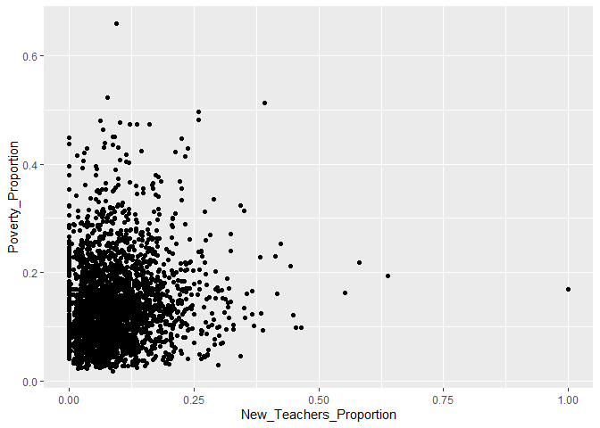<!-- -->
I am going to look at the correlation for new teachers.

``` r
cor.test(project_data$New_Teachers_Proportion, project_data$Poverty_Proportion)
```

    ## 
    ##  Pearson's product-moment correlation
    ## 
    ## data:  project_data$New_Teachers_Proportion and project_data$Poverty_Proportion
    ## t = 4.5651, df = 2791, p-value = 5.209e-06
    ## alternative hypothesis: true correlation is not equal to 0
    ## 95 percent confidence interval:
    ##  0.04915813 0.12278738
    ## sample estimates:
    ##        cor 
    ## 0.08609031

I am going to graph out absent teacher ratio to see the relationship.

``` r
project_data %>%
  ggplot(aes(Absent_Teacher_Proportion, Poverty_Proportion)) + 
  geom_point()
```

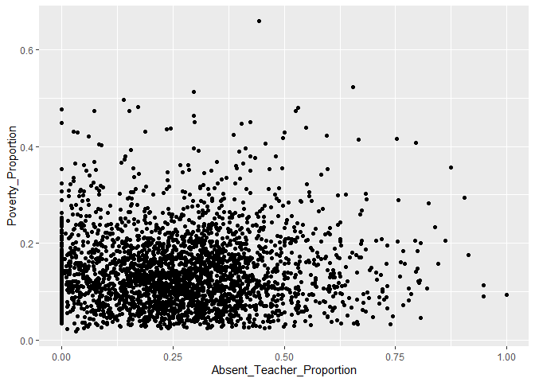<!-- -->
Looking at the correlation between for absent teachers.

``` r
cor.test(project_data$Absent_Teacher_Proportion, project_data$Poverty_Proportion)
```

    ## 
    ##  Pearson's product-moment correlation
    ## 
    ## data:  project_data$Absent_Teacher_Proportion and project_data$Poverty_Proportion
    ## t = 1.003, df = 2791, p-value = 0.3159
    ## alternative hypothesis: true correlation is not equal to 0
    ## 95 percent confidence interval:
    ##  -0.01811941  0.05603218
    ## sample estimates:
    ##        cor 
    ## 0.01898249

Looking at the graph of counselor ratio.

``` r
project_data %>%
  ggplot(aes(Counselor_Ratio, Poverty_Proportion)) + 
  geom_point()
```

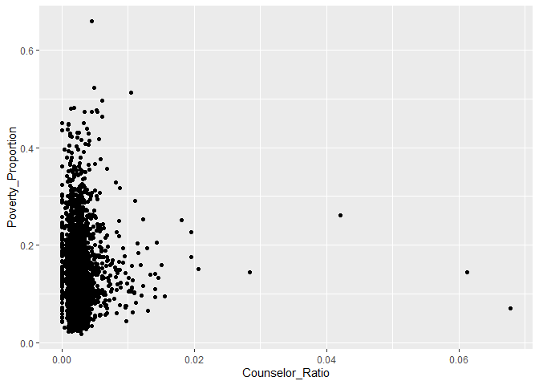<!-- -->
Look at the correlation for counselor ratio.

``` r
cor.test(project_data$Counselor_Ratio, project_data$Poverty_Proportion)
```

    ## 
    ##  Pearson's product-moment correlation
    ## 
    ## data:  project_data$Counselor_Ratio and project_data$Poverty_Proportion
    ## t = 1.5246, df = 2791, p-value = 0.1275
    ## alternative hypothesis: true correlation is not equal to 0
    ## 95 percent confidence interval:
    ##  -0.008251254  0.065865379
    ## sample estimates:
    ##        cor 
    ## 0.02884671

Looking at the graph with the student\_teacher\_ratio.

``` r
project_data %>%
  ggplot(aes(Student_Teacher_Ratio, Poverty_Proportion)) + 
  geom_point()
```

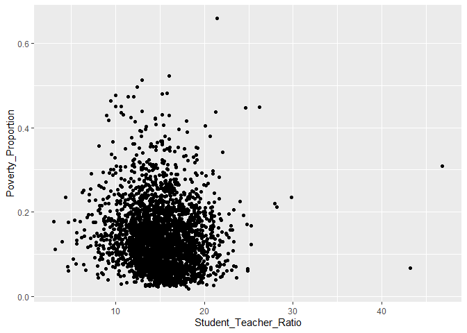<!-- -->
Looking at the correlation with student teacher ratio.

``` r
cor.test(project_data$Student_Teacher_Ratio, project_data$Poverty_Proportion)
```

    ## 
    ##  Pearson's product-moment correlation
    ## 
    ## data:  project_data$Student_Teacher_Ratio and project_data$Poverty_Proportion
    ## t = -4.7337, df = 2791, p-value = 2.315e-06
    ## alternative hypothesis: true correlation is not equal to 0
    ## 95 percent confidence interval:
    ##  -0.12591719 -0.05232891
    ## sample estimates:
    ##         cor 
    ## -0.08924484

Looking at how chronic abseentism graphs with poverty.

``` r
project_data %>%
  ggplot(aes(Absent_Prop, Poverty_Proportion)) + 
  geom_point()
```

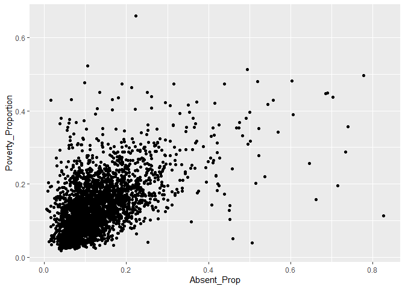<!-- -->
Looking at the correlation for absent and poverty.

``` r
cor.test(project_data$Absent_Prop, project_data$Poverty_Proportion)
```

    ## 
    ##  Pearson's product-moment correlation
    ## 
    ## data:  project_data$Absent_Prop and project_data$Poverty_Proportion
    ## t = 33.217, df = 2791, p-value < 2.2e-16
    ## alternative hypothesis: true correlation is not equal to 0
    ## 95 percent confidence interval:
    ##  0.5051623 0.5583451
    ## sample estimates:
    ##       cor 
    ## 0.5322787

Looking at the graph of students that have taken the SAT or ACT compared
to poverty.

``` r
project_data %>%
  ggplot(aes(Test_Prop, Poverty_Proportion)) + 
  geom_point()
```

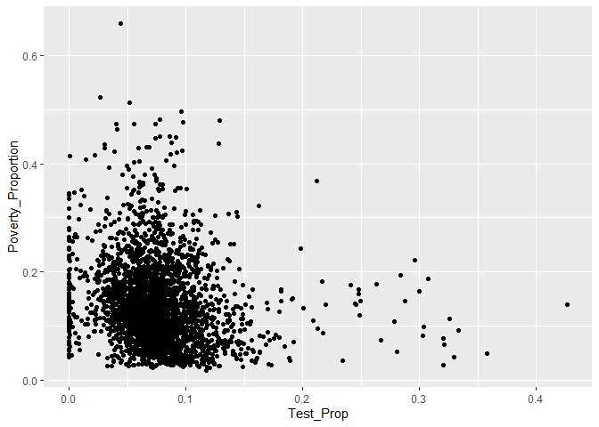<!-- -->
Look at the correlation of test takers.

``` r
cor.test(project_data$Test_Prop, project_data$Poverty_Proportion)
```

    ## 
    ##  Pearson's product-moment correlation
    ## 
    ## data:  project_data$Test_Prop and project_data$Poverty_Proportion
    ## t = -8.9982, df = 2791, p-value < 2.2e-16
    ## alternative hypothesis: true correlation is not equal to 0
    ## 95 percent confidence interval:
    ##  -0.2037265 -0.1316367
    ## sample estimates:
    ##        cor 
    ## -0.1679061

Looking at how sports team relates to poverty.

``` r
project_data %>%
  ggplot(aes(Teams_Prop, Poverty_Proportion)) + 
  geom_point()
```

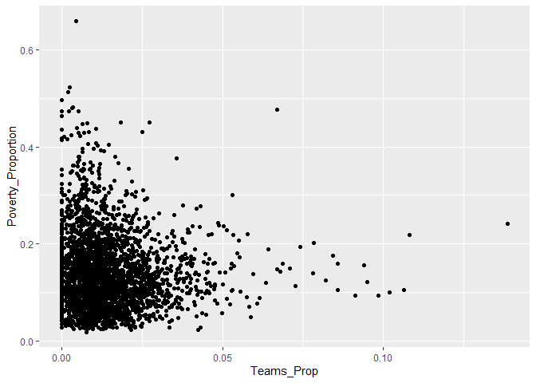<!-- -->
Looking at the correlation of teams to poverty.

``` r
cor.test(project_data$Teams_Prop, project_data$Poverty_Proportion)
```

    ## 
    ##  Pearson's product-moment correlation
    ## 
    ## data:  project_data$Teams_Prop and project_data$Poverty_Proportion
    ## t = -3.5757, df = 2791, p-value = 0.0003552
    ## alternative hypothesis: true correlation is not equal to 0
    ## 95 percent confidence interval:
    ##  -0.10435709 -0.03051662
    ## sample estimates:
    ##         cor 
    ## -0.06752933

Looking at athletes compared to poverty.

``` r
project_data %>%
  ggplot(aes(Athletes_Prop, Poverty_Proportion)) + 
  geom_point()
```

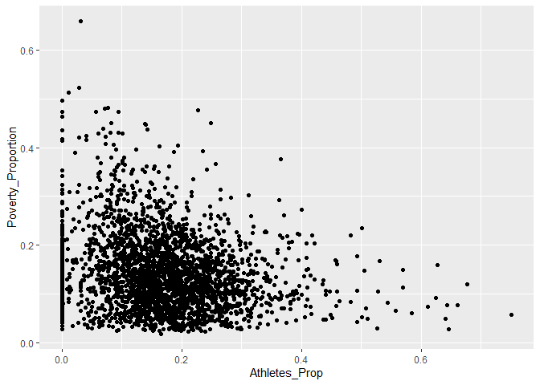<!-- -->
Looking at the correlation of athletes.

``` r
cor.test(project_data$Athletes_Prop, project_data$Poverty_Proportion)
```

    ## 
    ##  Pearson's product-moment correlation
    ## 
    ## data:  project_data$Athletes_Prop and project_data$Poverty_Proportion
    ## t = -10.803, df = 2791, p-value < 2.2e-16
    ## alternative hypothesis: true correlation is not equal to 0
    ## 95 percent confidence interval:
    ##  -0.2356718 -0.1644666
    ## sample estimates:
    ##        cor 
    ## -0.2003338

Looking at how ap test takers compare to poverty.

``` r
project_data %>%
  ggplot(aes(Takers_Proportion, Poverty_Proportion)) + 
  geom_point()
```

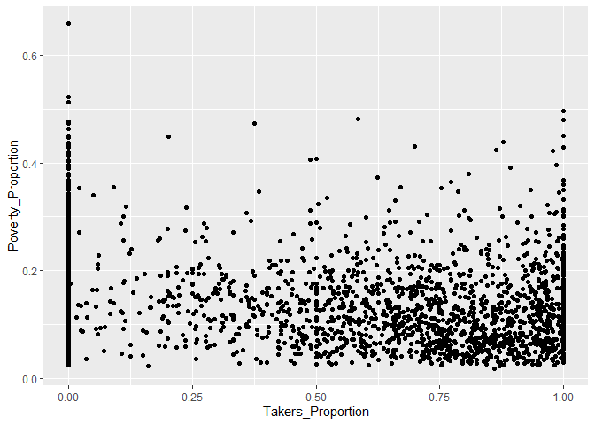<!-- -->
Looking at the correlation for the Ap test takers.

``` r
cor.test(project_data$Takers_Proportion, project_data$Poverty_Proportion)
```

    ## 
    ##  Pearson's product-moment correlation
    ## 
    ## data:  project_data$Takers_Proportion and project_data$Poverty_Proportion
    ## t = -11.513, df = 2791, p-value < 2.2e-16
    ## alternative hypothesis: true correlation is not equal to 0
    ## 95 percent confidence interval:
    ##  -0.2480517 -0.1772319
    ## sample estimates:
    ##        cor 
    ## -0.2129214

Looking at AP students compared to poverty.

``` r
project_data %>%
  ggplot(aes(AP_Prop, Poverty_Proportion)) + 
  geom_point()
```

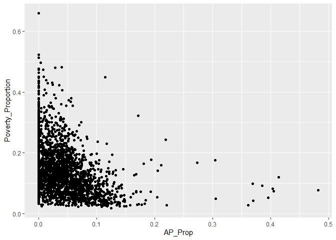<!-- -->
Correlation of AP students to poverty.

``` r
cor.test(project_data$AP_Prop, project_data$Poverty_Proportion)
```

    ## 
    ##  Pearson's product-moment correlation
    ## 
    ## data:  project_data$AP_Prop and project_data$Poverty_Proportion
    ## t = -17.63, df = 2791, p-value < 2.2e-16
    ## alternative hypothesis: true correlation is not equal to 0
    ## 95 percent confidence interval:
    ##  -0.3495416 -0.2827874
    ## sample estimates:
    ##        cor 
    ## -0.3165564

Suspension days compared to poverty.

``` r
project_data %>%
  ggplot(aes(AVG_Suspenion, Poverty_Proportion)) + 
  geom_point()
```

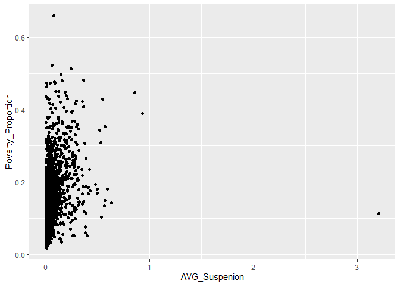<!-- -->
I want to look at the correlation of suspension with poverty.

``` r
cor.test(project_data$AVG_Suspenion, project_data$Poverty_Proportion)
```

    ## 
    ##  Pearson's product-moment correlation
    ## 
    ## data:  project_data$AVG_Suspenion and project_data$Poverty_Proportion
    ## t = 16.89, df = 2791, p-value < 2.2e-16
    ## alternative hypothesis: true correlation is not equal to 0
    ## 95 percent confidence interval:
    ##  0.2704934 0.3378012
    ## sample estimates:
    ##       cor 
    ## 0.3045274

I want to look at expulsions compared to poverty.

``` r
project_data %>%
  ggplot(aes(Expulsion_Prop, Poverty_Proportion)) + 
  geom_point()
```

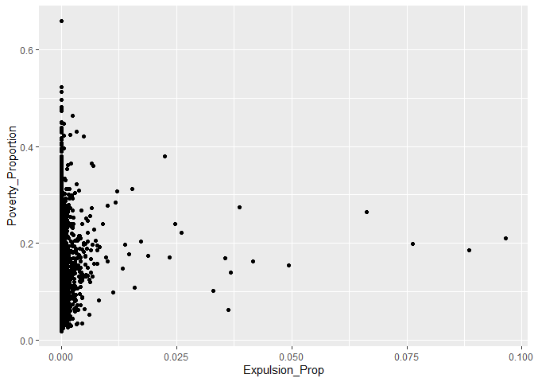<!-- -->
Look at correlation of expulsion to poverty.

``` r
cor.test(project_data$Expulsion_Prop, project_data$Poverty_Proportion)
```

    ## 
    ##  Pearson's product-moment correlation
    ## 
    ## data:  project_data$Expulsion_Prop and project_data$Poverty_Proportion
    ## t = 3.9073, df = 2791, p-value = 9.553e-05
    ## alternative hypothesis: true correlation is not equal to 0
    ## 95 percent confidence interval:
    ##  0.03677073 0.11054600
    ## sample estimates:
    ##        cor 
    ## 0.07375928

Police involvement compared to poverty.

``` r
project_data %>%
  ggplot(aes(Police_Prop, Poverty_Proportion)) + 
  geom_point()
```

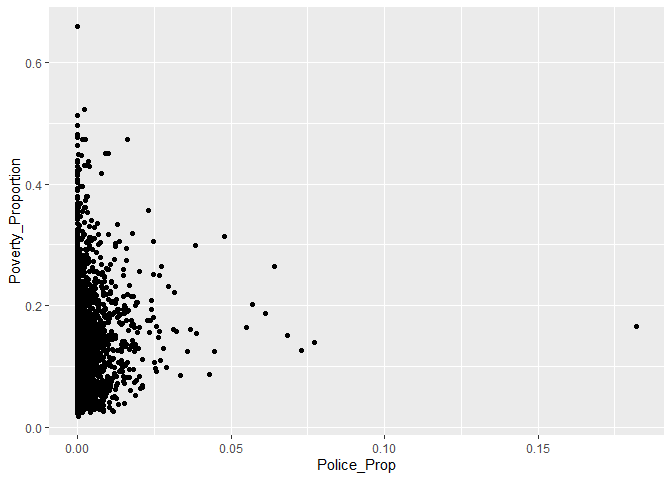<!-- -->
Correlation of police involvement to poverty.

``` r
cor.test(project_data$Police_Prop, project_data$Poverty_Proportion)
```

    ## 
    ##  Pearson's product-moment correlation
    ## 
    ## data:  project_data$Police_Prop and project_data$Poverty_Proportion
    ## t = 2.2109, df = 2791, p-value = 0.02712
    ## alternative hypothesis: true correlation is not equal to 0
    ## 95 percent confidence interval:
    ##  0.004731027 0.078779793
    ## sample estimates:
    ##        cor 
    ## 0.04181283

Student proportion compared to population and poverty.

``` r
project_data %>%
  ggplot(aes(Student_Prop, Poverty_Proportion)) + 
  geom_point()
```

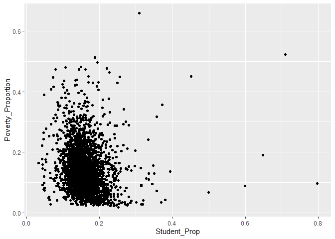<!-- -->
Look at the correlation of the student proportion.

``` r
cor.test(project_data$Student_Prop, project_data$Poverty_Proportion)
```

    ## 
    ##  Pearson's product-moment correlation
    ## 
    ## data:  project_data$Student_Prop and project_data$Poverty_Proportion
    ## t = -8.005, df = 2791, p-value = 1.736e-15
    ## alternative hypothesis: true correlation is not equal to 0
    ## 95 percent confidence interval:
    ##  -0.1858700 -0.1133544
    ## sample estimates:
    ##        cor 
    ## -0.1498137

For the next part I will look at correlations as they relate to bullying
on race and gender.

``` r
project_data %>%
  ggplot(aes(Race_Disc, Poverty_Proportion)) + 
  geom_point()
```

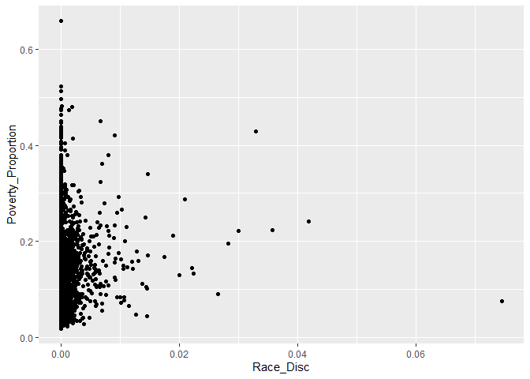<!-- -->

``` r
cor.test(project_data$Race_Disc, project_data$Poverty_Proportion)
```

    ## 
    ##  Pearson's product-moment correlation
    ## 
    ## data:  project_data$Race_Disc and project_data$Poverty_Proportion
    ## t = 2.5907, df = 2791, p-value = 0.009627
    ## alternative hypothesis: true correlation is not equal to 0
    ## 95 percent confidence interval:
    ##  0.01191275 0.08591331
    ## sample estimates:
    ##        cor 
    ## 0.04898025

``` r
project_data %>%
  ggplot(aes(Race_Reports, Poverty_Proportion)) + 
  geom_point()
```

<!-- -->

``` r
cor.test(project_data$Race_Reports, project_data$Poverty_Proportion)
```

    ## 
    ##  Pearson's product-moment correlation
    ## 
    ## data:  project_data$Race_Reports and project_data$Poverty_Proportion
    ## t = 2.2606, df = 2791, p-value = 0.02386
    ## alternative hypothesis: true correlation is not equal to 0
    ## 95 percent confidence interval:
    ##  0.005671372 0.079714258
    ## sample estimates:
    ##        cor 
    ## 0.04275152

``` r
project_data %>%
  ggplot(aes(Gender_Disc, Poverty_Proportion)) + 
  geom_point()
```

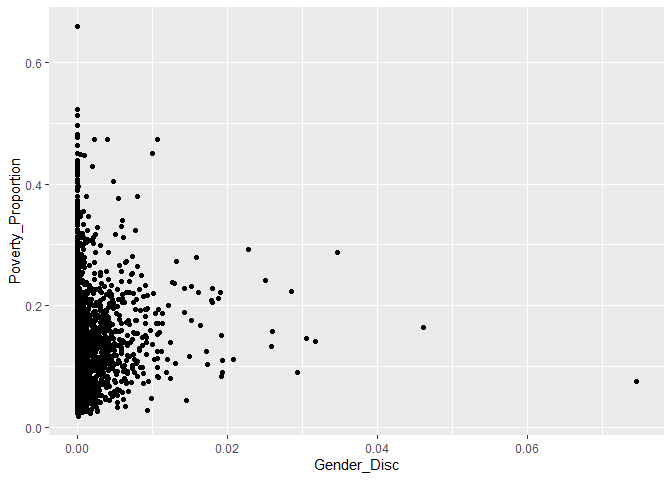<!-- -->

``` r
cor.test(project_data$Gender_Disc, project_data$Poverty_Proportion)
```

    ## 
    ##  Pearson's product-moment correlation
    ## 
    ## data:  project_data$Gender_Disc and project_data$Poverty_Proportion
    ## t = 1.981, df = 2791, p-value = 0.04769
    ## alternative hypothesis: true correlation is not equal to 0
    ## 95 percent confidence interval:
    ##  0.0003819737 0.0744562417
    ## sample estimates:
    ##        cor 
    ## 0.03747058

``` r
project_data %>%
  ggplot(aes(Gender_Reports, Poverty_Proportion)) + 
  geom_point()
```

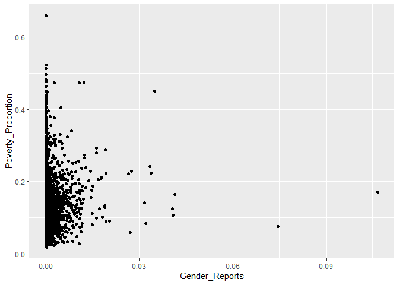<!-- -->

``` r
cor.test(project_data$Gender_Reports, project_data$Poverty_Proportion)
```

    ## 
    ##  Pearson's product-moment correlation
    ## 
    ## data:  project_data$Gender_Reports and project_data$Poverty_Proportion
    ## t = 1.5759, df = 2791, p-value = 0.1152
    ## alternative hypothesis: true correlation is not equal to 0
    ## 95 percent confidence interval:
    ##  -0.007281319  0.066831103
    ## sample estimates:
    ##        cor 
    ## 0.02981587

I will now run correlations on the different courses that are offered by
districts.

``` r
project_data %>%
  ggplot(aes(Alg1, Poverty_Proportion)) + 
  geom_point()
```

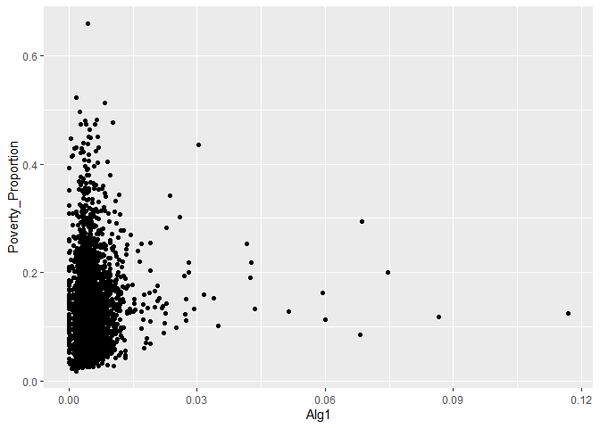<!-- -->

``` r
cor.test(project_data$Alg1, project_data$Poverty_Proportion)
```

    ## 
    ##  Pearson's product-moment correlation
    ## 
    ## data:  project_data$Alg1 and project_data$Poverty_Proportion
    ## t = 3.7368, df = 2791, p-value = 0.0001901
    ## alternative hypothesis: true correlation is not equal to 0
    ## 95 percent confidence interval:
    ##  0.03355487 0.10736437
    ## sample estimates:
    ##        cor 
    ## 0.07055619

``` r
project_data %>%
  ggplot(aes(Alg2, Poverty_Proportion)) + 
  geom_point()
```

<!-- -->

``` r
cor.test(project_data$Alg2, project_data$Poverty_Proportion)
```

    ## 
    ##  Pearson's product-moment correlation
    ## 
    ## data:  project_data$Alg2 and project_data$Poverty_Proportion
    ## t = 0.23647, df = 2791, p-value = 0.8131
    ## alternative hypothesis: true correlation is not equal to 0
    ## 95 percent confidence interval:
    ##  -0.03261854  0.04155825
    ## sample estimates:
    ##         cor 
    ## 0.004476009

``` r
project_data %>%
  ggplot(aes(Geo, Poverty_Proportion)) + 
  geom_point()
```

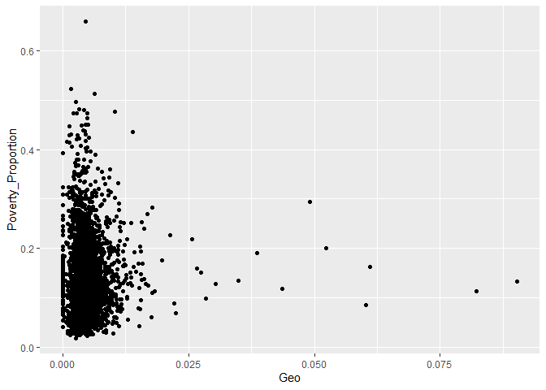<!-- -->

``` r
cor.test(project_data$Geo, project_data$Poverty_Proportion)
```

    ## 
    ##  Pearson's product-moment correlation
    ## 
    ## data:  project_data$Geo and project_data$Poverty_Proportion
    ## t = 0.66682, df = 2791, p-value = 0.5049
    ## alternative hypothesis: true correlation is not equal to 0
    ## 95 percent confidence interval:
    ##  -0.02447957  0.04968690
    ## sample estimates:
    ##        cor 
    ## 0.01262103

``` r
project_data %>%
  ggplot(aes(AdvMath, Poverty_Proportion)) + 
  geom_point()
```

<!-- -->

``` r
cor.test(project_data$AdvMath, project_data$Poverty_Proportion)
```

    ## 
    ##  Pearson's product-moment correlation
    ## 
    ## data:  project_data$AdvMath and project_data$Poverty_Proportion
    ## t = -5.8203, df = 2791, p-value = 6.544e-09
    ## alternative hypothesis: true correlation is not equal to 0
    ## 95 percent confidence interval:
    ##  -0.14600385 -0.07271391
    ## sample estimates:
    ##        cor 
    ## -0.1095077

``` r
project_data %>%
  ggplot(aes(Calc, Poverty_Proportion)) + 
  geom_point()
```

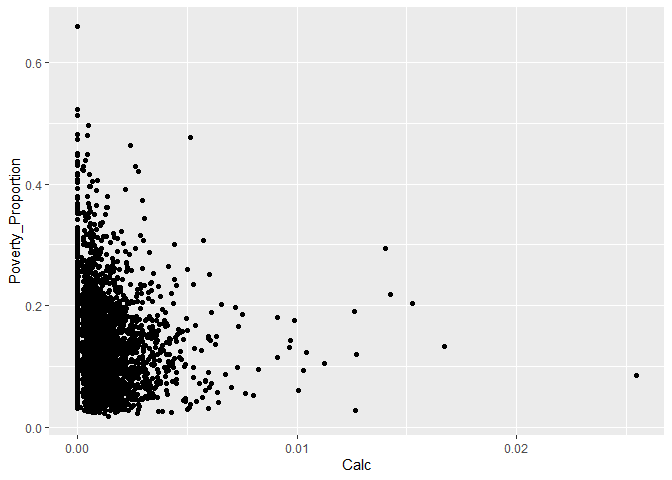<!-- -->

``` r
cor.test(project_data$Calc, project_data$Poverty_Proportion)
```

    ## 
    ##  Pearson's product-moment correlation
    ## 
    ## data:  project_data$Calc and project_data$Poverty_Proportion
    ## t = -6.7886, df = 2791, p-value = 1.377e-11
    ## alternative hypothesis: true correlation is not equal to 0
    ## 95 percent confidence interval:
    ##  -0.16376713 -0.09079218
    ## sample estimates:
    ##        cor 
    ## -0.1274521

``` r
project_data %>%
  ggplot(aes(Bio, Poverty_Proportion)) + 
  geom_point()
```

<!-- -->

``` r
cor.test(project_data$Bio, project_data$Poverty_Proportion)
```

    ## 
    ##  Pearson's product-moment correlation
    ## 
    ## data:  project_data$Bio and project_data$Poverty_Proportion
    ## t = -0.61618, df = 2791, p-value = 0.5378
    ## alternative hypothesis: true correlation is not equal to 0
    ## 95 percent confidence interval:
    ##  -0.04873079  0.02543740
    ## sample estimates:
    ##         cor 
    ## -0.01166274

``` r
project_data %>%
  ggplot(aes(Chem, Poverty_Proportion)) + 
  geom_point()
```

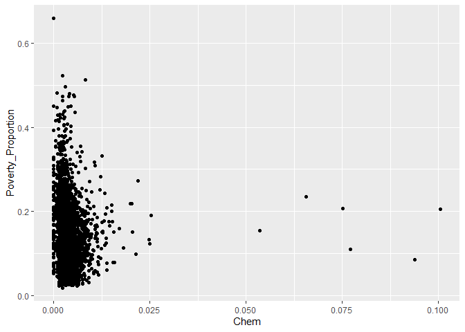<!-- -->

``` r
cor.test(project_data$Chem, project_data$Poverty_Proportion)
```

    ## 
    ##  Pearson's product-moment correlation
    ## 
    ## data:  project_data$Chem and project_data$Poverty_Proportion
    ## t = -2.9456, df = 2791, p-value = 0.00325
    ## alternative hypothesis: true correlation is not equal to 0
    ## 95 percent confidence interval:
    ##  -0.09256714 -0.01861843
    ## sample estimates:
    ##         cor 
    ## -0.05566913

``` r
project_data %>%
  ggplot(aes(Phys, Poverty_Proportion)) + 
  geom_point()
```

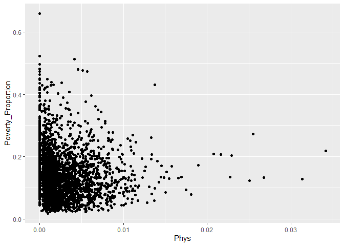<!-- -->

``` r
cor.test(project_data$Phys, project_data$Poverty_Proportion)
```

    ## 
    ##  Pearson's product-moment correlation
    ## 
    ## data:  project_data$Phys and project_data$Poverty_Proportion
    ## t = -4.3773, df = 2791, p-value = 1.246e-05
    ## alternative hypothesis: true correlation is not equal to 0
    ## 95 percent confidence interval:
    ##  -0.11929733 -0.04562414
    ## sample estimates:
    ##         cor 
    ## -0.08257355

I am going to look at the data for students that passed Algebra and the
correlations.

``` r
project_data %>%
  ggplot(aes(Early_Pass, Poverty_Proportion)) + 
  geom_point()
```

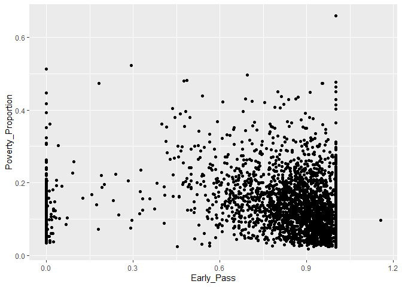<!-- -->

``` r
cor.test(project_data$Early_Pass, project_data$Poverty_Proportion)
```

    ## 
    ##  Pearson's product-moment correlation
    ## 
    ## data:  project_data$Early_Pass and project_data$Poverty_Proportion
    ## t = -5.9727, df = 2791, p-value = 2.629e-09
    ## alternative hypothesis: true correlation is not equal to 0
    ## 95 percent confidence interval:
    ##  -0.1488090 -0.0755656
    ## sample estimates:
    ##        cor 
    ## -0.1123399

``` r
project_data %>%
  ggplot(aes(Late_Pass, Poverty_Proportion)) + 
  geom_point()
```

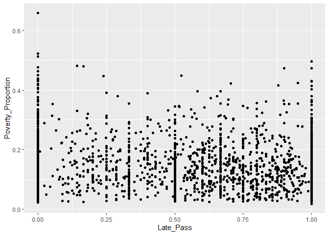<!-- -->

``` r
cor.test(project_data$Late_Pass, project_data$Poverty_Proportion)
```

    ## 
    ##  Pearson's product-moment correlation
    ## 
    ## data:  project_data$Late_Pass and project_data$Poverty_Proportion
    ## t = -1.8176, df = 2791, p-value = 0.06923
    ## alternative hypothesis: true correlation is not equal to 0
    ## 95 percent confidence interval:
    ##  -0.071382975  0.002707717
    ## sample estimates:
    ##         cor 
    ## -0.03438487

Look at demographics and how they relate to poverty.

``` r
project_data %>%
  ggplot(aes(Non_White_Students, Poverty_Proportion)) + 
  geom_point()
```

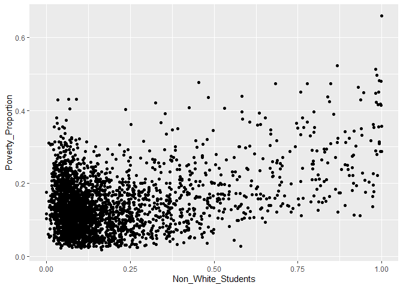<!-- -->

``` r
cor.test(project_data$Non_White_Students, project_data$Poverty_Proportion)
```

    ## 
    ##  Pearson's product-moment correlation
    ## 
    ## data:  project_data$Non_White_Students and project_data$Poverty_Proportion
    ## t = 21.5, df = 2791, p-value < 2.2e-16
    ## alternative hypothesis: true correlation is not equal to 0
    ## 95 percent confidence interval:
    ##  0.3446822 0.4083327
    ## sample estimates:
    ##       cor 
    ## 0.3769524

Look at how grad rate and poverty relate and the correlation of it.

``` r
project_data %>%
  ggplot(aes(Grad_Rate, Poverty_Proportion)) + 
  geom_point()
```

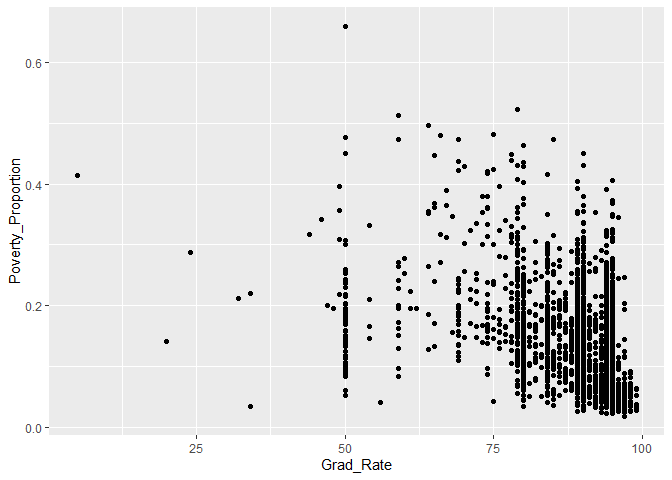<!-- -->

``` r
cor.test(project_data$Grad_Rate, project_data$Poverty_Proportion)
```

    ## 
    ##  Pearson's product-moment correlation
    ## 
    ## data:  project_data$Grad_Rate and project_data$Poverty_Proportion
    ## t = -20.506, df = 2791, p-value < 2.2e-16
    ## alternative hypothesis: true correlation is not equal to 0
    ## 95 percent confidence interval:
    ##  -0.3936511 -0.3291735
    ## sample estimates:
    ##       cor 
    ## -0.361845
