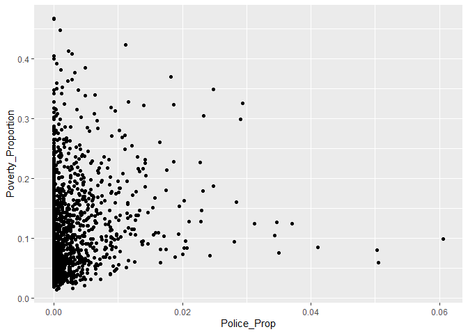
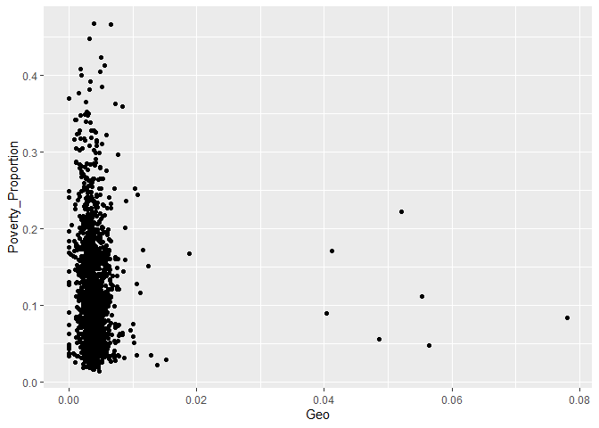

Northeast Correlations
================
Derek Castleman
9/1/2021

In this markdown I will look at each of the features and run
correlations on them to see how they relate with poverty proportion. I
will also graph out each one of them to get a visual on the
relationship.

I am going to first load in the project data that was prepared and then
take a look at it.

``` r
library(tidyverse)
```

    ## -- Attaching packages --------------------------------------- tidyverse 1.3.0 --

    ## v ggplot2 3.3.3     v purrr   0.3.4
    ## v tibble  3.0.6     v dplyr   1.0.4
    ## v tidyr   1.1.2     v stringr 1.4.0
    ## v readr   1.4.0     v forcats 0.5.1

    ## -- Conflicts ------------------------------------------ tidyverse_conflicts() --
    ## x dplyr::filter() masks stats::filter()
    ## x dplyr::lag()    masks stats::lag()

``` r
project_data <- read_csv("northeast_data.csv")
```

    ## Warning: Missing column names filled in: 'X1' [1]

    ## 
    ## -- Column specification --------------------------------------------------------
    ## cols(
    ##   .default = col_double(),
    ##   `Lea State.x` = col_character(),
    ##   LEA.x = col_character()
    ## )
    ## i Use `spec()` for the full column specifications.

``` r
project_data
```

    ## # A tibble: 1,474 x 39
    ##       X1 `Unnamed: 0`     ID `Lea State.x` LEA.x Area_Population
    ##    <dbl>        <dbl>  <dbl> <chr>         <chr>           <dbl>
    ##  1   818          819 900060 CT            Anso~           19210
    ##  2   819          820 900120 CT            Avon~           18118
    ##  3   820          821 900210 CT            Berl~           19903
    ##  4   821          822 900270 CT            Beth~           19249
    ##  5   822          823 900330 CT            Bloo~           20511
    ##  6   823          824 900360 CT            Bolt~            4936
    ##  7   824          825 900420 CT            Bran~           27960
    ##  8   825          826 900450 CT            Brid~          149439
    ##  9   826          827 900510 CT            Bris~           60566
    ## 10   827          828 900540 CT            Broo~           17036
    ## # ... with 1,464 more rows, and 33 more variables: Children_Poverty <dbl>,
    ## #   Poverty_Proportion <dbl>, Student_Prop <dbl>, District_Population <dbl>,
    ## #   Non_White_Students <dbl>, New_Teachers_Proportion <dbl>,
    ## #   Absent_Teacher_Proportion <dbl>, Counselor_Ratio <dbl>,
    ## #   Student_Teacher_Ratio <dbl>, Absent_Prop <dbl>, Test_Prop <dbl>,
    ## #   Teams_Prop <dbl>, Athletes_Prop <dbl>, Takers_Proportion <dbl>,
    ## #   AP_Prop <dbl>, AVG_Suspenion <dbl>, Expulsion_Prop <dbl>,
    ## #   Police_Prop <dbl>, Race_Disc <dbl>, Race_Reports <dbl>, Gender_Disc <dbl>,
    ## #   Gender_Reports <dbl>, Alg1 <dbl>, Alg2 <dbl>, Geo <dbl>, AdvMath <dbl>,
    ## #   Calc <dbl>, Bio <dbl>, Chem <dbl>, Phys <dbl>, Early_Pass <dbl>,
    ## #   Late_Pass <dbl>, Grad_Rate <dbl>

Look at a plot of poverty compared to new teacher.

``` r
project_data %>%
  ggplot(aes(New_Teachers_Proportion, Poverty_Proportion)) + 
  geom_point()
```

<!-- -->
I am going to look at the correlation for new teachers.

``` r
cor.test(project_data$New_Teachers_Proportion, project_data$Poverty_Proportion)
```

    ## 
    ##  Pearson's product-moment correlation
    ## 
    ## data:  project_data$New_Teachers_Proportion and project_data$Poverty_Proportion
    ## t = 7.7791, df = 1472, p-value = 1.365e-14
    ## alternative hypothesis: true correlation is not equal to 0
    ## 95 percent confidence interval:
    ##  0.1491699 0.2472638
    ## sample estimates:
    ##       cor 
    ## 0.1987145

I am going to graph out absent teacher ratio to see the relationship.

``` r
project_data %>%
  ggplot(aes(Absent_Teacher_Proportion, Poverty_Proportion)) + 
  geom_point()
```

<!-- -->
Looking at the correlation between for absent teachers.

``` r
cor.test(project_data$Absent_Teacher_Proportion, project_data$Poverty_Proportion)
```

    ## 
    ##  Pearson's product-moment correlation
    ## 
    ## data:  project_data$Absent_Teacher_Proportion and project_data$Poverty_Proportion
    ## t = 5.0786, df = 1472, p-value = 4.288e-07
    ## alternative hypothesis: true correlation is not equal to 0
    ## 95 percent confidence interval:
    ##  0.08070864 0.18107072
    ## sample estimates:
    ##       cor 
    ## 0.1312259

Looking at the graph of counselor ratio.

``` r
project_data %>%
  ggplot(aes(Counselor_Ratio, Poverty_Proportion)) + 
  geom_point()
```

<!-- -->
Look at the correlation for counselor ratio.

``` r
cor.test(project_data$Counselor_Ratio, project_data$Poverty_Proportion)
```

    ## 
    ##  Pearson's product-moment correlation
    ## 
    ## data:  project_data$Counselor_Ratio and project_data$Poverty_Proportion
    ## t = -3.6, df = 1472, p-value = 0.0003287
    ## alternative hypothesis: true correlation is not equal to 0
    ## 95 percent confidence interval:
    ##  -0.14379428 -0.04256719
    ## sample estimates:
    ##         cor 
    ## -0.09342216

Looking at the graph with the student\_teacher\_ratio.

``` r
project_data %>%
  ggplot(aes(Student_Teacher_Ratio, Poverty_Proportion)) + 
  geom_point()
```

<!-- -->
Looking at the correlation with student teacher ratio.

``` r
cor.test(project_data$Student_Teacher_Ratio, project_data$Poverty_Proportion)
```

    ## 
    ##  Pearson's product-moment correlation
    ## 
    ## data:  project_data$Student_Teacher_Ratio and project_data$Poverty_Proportion
    ## t = 1.1542, df = 1472, p-value = 0.2486
    ## alternative hypothesis: true correlation is not equal to 0
    ## 95 percent confidence interval:
    ##  -0.02102082  0.08100312
    ## sample estimates:
    ##        cor 
    ## 0.03006947

Looking at how chronic abseentism graphs with poverty.

``` r
project_data %>%
  ggplot(aes(Absent_Prop, Poverty_Proportion)) + 
  geom_point()
```

<!-- -->
Looking at the correlation for absent and poverty.

``` r
cor.test(project_data$Absent_Prop, project_data$Poverty_Proportion)
```

    ## 
    ##  Pearson's product-moment correlation
    ## 
    ## data:  project_data$Absent_Prop and project_data$Poverty_Proportion
    ## t = 38.138, df = 1472, p-value < 2.2e-16
    ## alternative hypothesis: true correlation is not equal to 0
    ## 95 percent confidence interval:
    ##  0.6783448 0.7297753
    ## sample estimates:
    ##       cor 
    ## 0.7049857

Looking at the graph of students that have taken the SAT or ACT compared
to poverty.

``` r
project_data %>%
  ggplot(aes(Test_Prop, Poverty_Proportion)) + 
  geom_point()
```

<!-- -->
Look at the correlation of test takers.

``` r
cor.test(project_data$Test_Prop, project_data$Poverty_Proportion)
```

    ## 
    ##  Pearson's product-moment correlation
    ## 
    ## data:  project_data$Test_Prop and project_data$Poverty_Proportion
    ## t = -16.93, df = 1472, p-value < 2.2e-16
    ## alternative hypothesis: true correlation is not equal to 0
    ## 95 percent confidence interval:
    ##  -0.4455763 -0.3600664
    ## sample estimates:
    ##        cor 
    ## -0.4037026

Looking at how sports team relates to poverty.

``` r
project_data %>%
  ggplot(aes(Teams_Prop, Poverty_Proportion)) + 
  geom_point()
```

<!-- -->
Looking at the correlation of teams to poverty.

``` r
cor.test(project_data$Teams_Prop, project_data$Poverty_Proportion)
```

    ## 
    ##  Pearson's product-moment correlation
    ## 
    ## data:  project_data$Teams_Prop and project_data$Poverty_Proportion
    ## t = -4.6015, df = 1472, p-value = 4.555e-06
    ## alternative hypothesis: true correlation is not equal to 0
    ## 95 percent confidence interval:
    ##  -0.16911149 -0.06843978
    ## sample estimates:
    ##        cor 
    ## -0.1190817

Looking at athletes compared to poverty.

``` r
project_data %>%
  ggplot(aes(Athletes_Prop, Poverty_Proportion)) + 
  geom_point()
```

<!-- -->
Looking at the correlation of athletes.

``` r
cor.test(project_data$Athletes_Prop, project_data$Poverty_Proportion)
```

    ## 
    ##  Pearson's product-moment correlation
    ## 
    ## data:  project_data$Athletes_Prop and project_data$Poverty_Proportion
    ## t = -11.704, df = 1472, p-value < 2.2e-16
    ## alternative hypothesis: true correlation is not equal to 0
    ## 95 percent confidence interval:
    ##  -0.3377992 -0.2443558
    ## sample estimates:
    ##        cor 
    ## -0.2917735

Looking at how ap test takers compare to poverty.

``` r
project_data %>%
  ggplot(aes(Takers_Proportion, Poverty_Proportion)) + 
  geom_point()
```

<!-- -->
Looking at the correlation for the Ap test takers.

``` r
cor.test(project_data$Takers_Proportion, project_data$Poverty_Proportion)
```

    ## 
    ##  Pearson's product-moment correlation
    ## 
    ## data:  project_data$Takers_Proportion and project_data$Poverty_Proportion
    ## t = -10.49, df = 1472, p-value < 2.2e-16
    ## alternative hypothesis: true correlation is not equal to 0
    ## 95 percent confidence interval:
    ##  -0.3106171 -0.2155870
    ## sample estimates:
    ##        cor 
    ## -0.2637419

Looking at AP students compared to poverty.

``` r
project_data %>%
  ggplot(aes(AP_Prop, Poverty_Proportion)) + 
  geom_point()
```

<!-- -->
Correlation of AP students to poverty.

``` r
cor.test(project_data$AP_Prop, project_data$Poverty_Proportion)
```

    ## 
    ##  Pearson's product-moment correlation
    ## 
    ## data:  project_data$AP_Prop and project_data$Poverty_Proportion
    ## t = -24.643, df = 1472, p-value < 2.2e-16
    ## alternative hypothesis: true correlation is not equal to 0
    ## 95 percent confidence interval:
    ##  -0.5755982 -0.5032508
    ## sample estimates:
    ##        cor 
    ## -0.5404226

Suspension days compared to poverty.

``` r
project_data %>%
  ggplot(aes(AVG_Suspenion, Poverty_Proportion)) + 
  geom_point()
```

<!-- -->
I want to look at the correlation of suspension with poverty.

``` r
cor.test(project_data$AVG_Suspenion, project_data$Poverty_Proportion)
```

    ## 
    ##  Pearson's product-moment correlation
    ## 
    ## data:  project_data$AVG_Suspenion and project_data$Poverty_Proportion
    ## t = 23.583, df = 1472, p-value < 2.2e-16
    ## alternative hypothesis: true correlation is not equal to 0
    ## 95 percent confidence interval:
    ##  0.4855814 0.5597486
    ## sample estimates:
    ##       cor 
    ## 0.5236565

I want to look at expulsions compared to poverty.

``` r
project_data %>%
  ggplot(aes(Expulsion_Prop, Poverty_Proportion)) + 
  geom_point()
```

<!-- -->
Look at correlation of expulsion to poverty.

``` r
cor.test(project_data$Expulsion_Prop, project_data$Poverty_Proportion)
```

    ## 
    ##  Pearson's product-moment correlation
    ## 
    ## data:  project_data$Expulsion_Prop and project_data$Poverty_Proportion
    ## t = 5.6067, df = 1472, p-value = 2.459e-08
    ## alternative hypothesis: true correlation is not equal to 0
    ## 95 percent confidence interval:
    ##  0.09423611 0.19422248
    ## sample estimates:
    ##       cor 
    ## 0.1445984

Police involvement compared to poverty.

``` r
project_data %>%
  ggplot(aes(Police_Prop, Poverty_Proportion)) + 
  geom_point()
```

<!-- -->
Correlation of police involvement to poverty.

``` r
cor.test(project_data$Police_Prop, project_data$Poverty_Proportion)
```

    ## 
    ##  Pearson's product-moment correlation
    ## 
    ## data:  project_data$Police_Prop and project_data$Poverty_Proportion
    ## t = 5.0517, df = 1472, p-value = 4.926e-07
    ## alternative hypothesis: true correlation is not equal to 0
    ## 95 percent confidence interval:
    ##  0.08001786 0.18039816
    ## sample estimates:
    ##       cor 
    ## 0.1305425

Student proportion compared to population and poverty.

``` r
project_data %>%
  ggplot(aes(Student_Prop, Poverty_Proportion)) + 
  geom_point()
```

<!-- -->
Look at the correlation of the student proportion.

``` r
cor.test(project_data$Student_Prop, project_data$Poverty_Proportion)
```

    ## 
    ##  Pearson's product-moment correlation
    ## 
    ## data:  project_data$Student_Prop and project_data$Poverty_Proportion
    ## t = -6.5383, df = 1472, p-value = 8.557e-11
    ## alternative hypothesis: true correlation is not equal to 0
    ## 95 percent confidence interval:
    ##  -0.2171895 -0.1179480
    ## sample estimates:
    ##        cor 
    ## -0.1679944

For the next part I will look at correlations as they relate to bullying
on race and gender.

``` r
project_data %>%
  ggplot(aes(Race_Disc, Poverty_Proportion)) + 
  geom_point()
```

<!-- -->

``` r
cor.test(project_data$Race_Disc, project_data$Poverty_Proportion)
```

    ## 
    ##  Pearson's product-moment correlation
    ## 
    ## data:  project_data$Race_Disc and project_data$Poverty_Proportion
    ## t = 2.0929, df = 1472, p-value = 0.03653
    ## alternative hypothesis: true correlation is not equal to 0
    ## 95 percent confidence interval:
    ##  0.003421338 0.105235184
    ## sample estimates:
    ##        cor 
    ## 0.05446984

``` r
project_data %>%
  ggplot(aes(Race_Reports, Poverty_Proportion)) + 
  geom_point()
```

<!-- -->

``` r
cor.test(project_data$Race_Reports, project_data$Poverty_Proportion)
```

    ## 
    ##  Pearson's product-moment correlation
    ## 
    ## data:  project_data$Race_Reports and project_data$Poverty_Proportion
    ## t = 2.0255, df = 1472, p-value = 0.043
    ## alternative hypothesis: true correlation is not equal to 0
    ## 95 percent confidence interval:
    ##  0.001665102 0.103498066
    ## sample estimates:
    ##        cor 
    ## 0.05271864

``` r
project_data %>%
  ggplot(aes(Gender_Disc, Poverty_Proportion)) + 
  geom_point()
```

<!-- -->

``` r
cor.test(project_data$Gender_Disc, project_data$Poverty_Proportion)
```

    ## 
    ##  Pearson's product-moment correlation
    ## 
    ## data:  project_data$Gender_Disc and project_data$Poverty_Proportion
    ## t = 3.3675, df = 1472, p-value = 0.0007782
    ## alternative hypothesis: true correlation is not equal to 0
    ## 95 percent confidence interval:
    ##  0.0365394 0.1378768
    ## sample estimates:
    ##       cor 
    ## 0.0874343

``` r
project_data %>%
  ggplot(aes(Gender_Reports, Poverty_Proportion)) + 
  geom_point()
```

<!-- -->

``` r
cor.test(project_data$Gender_Reports, project_data$Poverty_Proportion)
```

    ## 
    ##  Pearson's product-moment correlation
    ## 
    ## data:  project_data$Gender_Reports and project_data$Poverty_Proportion
    ## t = 3.0319, df = 1472, p-value = 0.002472
    ## alternative hypothesis: true correlation is not equal to 0
    ## 95 percent confidence interval:
    ##  0.02783393 0.12931784
    ## sample estimates:
    ##        cor 
    ## 0.07877999

I will now run correlations on the different courses that are offered by
districts.

``` r
project_data %>%
  ggplot(aes(Alg1, Poverty_Proportion)) + 
  geom_point()
```

<!-- -->

``` r
cor.test(project_data$Alg1, project_data$Poverty_Proportion)
```

    ## 
    ##  Pearson's product-moment correlation
    ## 
    ## data:  project_data$Alg1 and project_data$Poverty_Proportion
    ## t = 4.1353, df = 1472, p-value = 3.745e-05
    ## alternative hypothesis: true correlation is not equal to 0
    ## 95 percent confidence interval:
    ##  0.05641372 0.15736008
    ## sample estimates:
    ##       cor 
    ## 0.1071631

``` r
project_data %>%
  ggplot(aes(Alg2, Poverty_Proportion)) + 
  geom_point()
```

<!-- -->

``` r
cor.test(project_data$Alg2, project_data$Poverty_Proportion)
```

    ## 
    ##  Pearson's product-moment correlation
    ## 
    ## data:  project_data$Alg2 and project_data$Poverty_Proportion
    ## t = -4.6382, df = 1472, p-value = 3.825e-06
    ## alternative hypothesis: true correlation is not equal to 0
    ## 95 percent confidence interval:
    ##  -0.17003491 -0.06938603
    ## sample estimates:
    ##        cor 
    ## -0.1200189

``` r
project_data %>%
  ggplot(aes(Geo, Poverty_Proportion)) + 
  geom_point()
```

<!-- -->

``` r
cor.test(project_data$Geo, project_data$Poverty_Proportion)
```

    ## 
    ##  Pearson's product-moment correlation
    ## 
    ## data:  project_data$Geo and project_data$Poverty_Proportion
    ## t = -1.8608, df = 1472, p-value = 0.06297
    ## alternative hypothesis: true correlation is not equal to 0
    ## 95 percent confidence interval:
    ##  -0.09925697  0.00262003
    ## sample estimates:
    ##         cor 
    ## -0.04844447

``` r
project_data %>%
  ggplot(aes(AdvMath, Poverty_Proportion)) + 
  geom_point()
```

<!-- -->

``` r
cor.test(project_data$AdvMath, project_data$Poverty_Proportion)
```

    ## 
    ##  Pearson's product-moment correlation
    ## 
    ## data:  project_data$AdvMath and project_data$Poverty_Proportion
    ## t = -6.1773, df = 1472, p-value = 8.421e-10
    ## alternative hypothesis: true correlation is not equal to 0
    ## 95 percent confidence interval:
    ##  -0.2083269 -0.1087846
    ## sample estimates:
    ##        cor 
    ## -0.1589597

``` r
project_data %>%
  ggplot(aes(Calc, Poverty_Proportion)) + 
  geom_point()
```

<!-- -->

``` r
cor.test(project_data$Calc, project_data$Poverty_Proportion)
```

    ## 
    ##  Pearson's product-moment correlation
    ## 
    ## data:  project_data$Calc and project_data$Poverty_Proportion
    ## t = -8.1375, df = 1472, p-value = 8.501e-16
    ## alternative hypothesis: true correlation is not equal to 0
    ## 95 percent confidence interval:
    ##  -0.255830 -0.158099
    ## sample estimates:
    ##        cor 
    ## -0.2074822

``` r
project_data %>%
  ggplot(aes(Bio, Poverty_Proportion)) + 
  geom_point()
```

<!-- -->

``` r
cor.test(project_data$Bio, project_data$Poverty_Proportion)
```

    ## 
    ##  Pearson's product-moment correlation
    ## 
    ## data:  project_data$Bio and project_data$Poverty_Proportion
    ## t = -2.5584, df = 1472, p-value = 0.01061
    ## alternative hypothesis: true correlation is not equal to 0
    ## 95 percent confidence interval:
    ##  -0.11719565 -0.01553051
    ## sample estimates:
    ##         cor 
    ## -0.06653577

``` r
project_data %>%
  ggplot(aes(Chem, Poverty_Proportion)) + 
  geom_point()
```

<!-- -->

``` r
cor.test(project_data$Chem, project_data$Poverty_Proportion)
```

    ## 
    ##  Pearson's product-moment correlation
    ## 
    ## data:  project_data$Chem and project_data$Poverty_Proportion
    ## t = -5.4574, df = 1472, p-value = 5.661e-08
    ## alternative hypothesis: true correlation is not equal to 0
    ## 95 percent confidence interval:
    ##  -0.19051402 -0.09041797
    ## sample estimates:
    ##        cor 
    ## -0.1408259

``` r
project_data %>%
  ggplot(aes(Phys, Poverty_Proportion)) + 
  geom_point()
```

<!-- -->

``` r
cor.test(project_data$Phys, project_data$Poverty_Proportion)
```

    ## 
    ##  Pearson's product-moment correlation
    ## 
    ## data:  project_data$Phys and project_data$Poverty_Proportion
    ## t = -8.9363, df = 1472, p-value < 2.2e-16
    ## alternative hypothesis: true correlation is not equal to 0
    ## 95 percent confidence interval:
    ##  -0.2747226 -0.1778484
    ## sample estimates:
    ##        cor 
    ## -0.2268465

I am going to look at the data for students that passed Algebra and the
correlations.

``` r
project_data %>%
  ggplot(aes(Early_Pass, Poverty_Proportion)) + 
  geom_point()
```

<!-- -->

``` r
cor.test(project_data$Early_Pass, project_data$Poverty_Proportion)
```

    ## 
    ##  Pearson's product-moment correlation
    ## 
    ## data:  project_data$Early_Pass and project_data$Poverty_Proportion
    ## t = -9.3628, df = 1472, p-value < 2.2e-16
    ## alternative hypothesis: true correlation is not equal to 0
    ## 95 percent confidence interval:
    ##  -0.2846905 -0.1882999
    ## sample estimates:
    ##        cor 
    ## -0.2370785

``` r
project_data %>%
  ggplot(aes(Late_Pass, Poverty_Proportion)) + 
  geom_point()
```

<!-- -->

``` r
cor.test(project_data$Late_Pass, project_data$Poverty_Proportion)
```

    ## 
    ##  Pearson's product-moment correlation
    ## 
    ## data:  project_data$Late_Pass and project_data$Poverty_Proportion
    ## t = 0.29325, df = 1472, p-value = 0.7694
    ## alternative hypothesis: true correlation is not equal to 0
    ## 95 percent confidence interval:
    ##  -0.04343196  0.05867812
    ## sample estimates:
    ##         cor 
    ## 0.007643003

Look at demographics and how they relate to poverty.

``` r
project_data %>%
  ggplot(aes(Non_White_Students, Poverty_Proportion)) + 
  geom_point()
```

<!-- -->

``` r
cor.test(project_data$Non_White_Students, project_data$Poverty_Proportion)
```

    ## 
    ##  Pearson's product-moment correlation
    ## 
    ## data:  project_data$Non_White_Students and project_data$Poverty_Proportion
    ## t = 14.074, df = 1472, p-value < 2.2e-16
    ## alternative hypothesis: true correlation is not equal to 0
    ## 95 percent confidence interval:
    ##  0.2985800 0.3886126
    ## sample estimates:
    ##       cor 
    ## 0.3443879

Look at how grad rate and poverty relate and the correlation of it.

``` r
project_data %>%
  ggplot(aes(Grad_Rate, Poverty_Proportion)) + 
  geom_point()
```

<!-- -->

``` r
cor.test(project_data$Grad_Rate, project_data$Poverty_Proportion)
```

    ## 
    ##  Pearson's product-moment correlation
    ## 
    ## data:  project_data$Grad_Rate and project_data$Poverty_Proportion
    ## t = -35.606, df = 1472, p-value < 2.2e-16
    ## alternative hypothesis: true correlation is not equal to 0
    ## 95 percent confidence interval:
    ##  -0.7067542 -0.6518241
    ## sample estimates:
    ##        cor 
    ## -0.6802431
