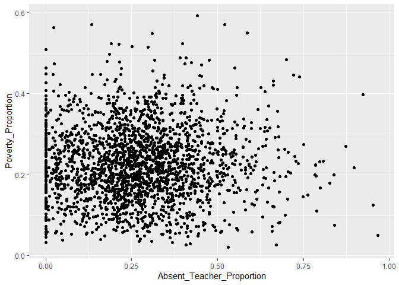
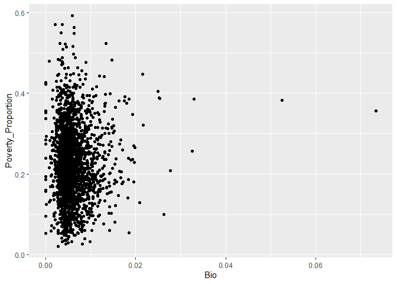

Southern Correlations
================
Derek Castleman
9/1/2021

In this markdown I will look at each of the features and run
correlations on them to see how they relate with poverty proportion. I
will also graph out each one of them to get a visual on the
relationship.

I am going to first load in the project data that was prepared and then
take a look at it.

``` r
library(tidyverse)
```

    ## -- Attaching packages --------------------------------------- tidyverse 1.3.0 --

    ## v ggplot2 3.3.3     v purrr   0.3.4
    ## v tibble  3.0.6     v dplyr   1.0.4
    ## v tidyr   1.1.2     v stringr 1.4.0
    ## v readr   1.4.0     v forcats 0.5.1

    ## -- Conflicts ------------------------------------------ tidyverse_conflicts() --
    ## x dplyr::filter() masks stats::filter()
    ## x dplyr::lag()    masks stats::lag()

``` r
project_data <- read_csv("southern_data.csv")
```

    ## Warning: Missing column names filled in: 'X1' [1]

    ## 
    ## -- Column specification --------------------------------------------------------
    ## cols(
    ##   .default = col_double(),
    ##   `Lea State.x` = col_character(),
    ##   LEA.x = col_character()
    ## )
    ## i Use `spec()` for the full column specifications.

``` r
project_data
```

    ## # A tibble: 2,215 x 39
    ##       X1 `Unnamed: 0`     ID `Lea State.x` LEA.x Area_Population
    ##    <dbl>        <dbl>  <dbl> <chr>         <chr>           <dbl>
    ##  1     0            1 100190 AL            Alab~           34015
    ##  2     1            2 100005 AL            Albe~           21786
    ##  3     2            3 100030 AL            Alex~           17073
    ##  4     3            4 100060 AL            Anda~            8854
    ##  5     4            5 100090 AL            Anni~           22350
    ##  6     5            6 100100 AL            Arab~            8305
    ##  7     6            7 100120 AL            Athe~           24963
    ##  8     7            8 100180 AL            Atta~            5952
    ##  9     8            9 100210 AL            Aubu~           61570
    ## 10     9           10 100240 AL            Auta~           55504
    ## # ... with 2,205 more rows, and 33 more variables: Children_Poverty <dbl>,
    ## #   Poverty_Proportion <dbl>, Student_Prop <dbl>, District_Population <dbl>,
    ## #   Non_White_Students <dbl>, New_Teachers_Proportion <dbl>,
    ## #   Absent_Teacher_Proportion <dbl>, Counselor_Ratio <dbl>,
    ## #   Student_Teacher_Ratio <dbl>, Absent_Prop <dbl>, Test_Prop <dbl>,
    ## #   Teams_Prop <dbl>, Athletes_Prop <dbl>, Takers_Proportion <dbl>,
    ## #   AP_Prop <dbl>, AVG_Suspenion <dbl>, Expulsion_Prop <dbl>,
    ## #   Police_Prop <dbl>, Race_Disc <dbl>, Race_Reports <dbl>, Gender_Disc <dbl>,
    ## #   Gender_Reports <dbl>, Alg1 <dbl>, Alg2 <dbl>, Geo <dbl>, AdvMath <dbl>,
    ## #   Calc <dbl>, Bio <dbl>, Chem <dbl>, Phys <dbl>, Early_Pass <dbl>,
    ## #   Late_Pass <dbl>, Grad_Rate <dbl>

Look at a plot of poverty compared to new teacher.

``` r
project_data %>%
  ggplot(aes(New_Teachers_Proportion, Poverty_Proportion)) + 
  geom_point()
```

<!-- -->
I am going to look at the correlation for new teachers.

``` r
cor.test(project_data$New_Teachers_Proportion, project_data$Poverty_Proportion)
```

    ## 
    ##  Pearson's product-moment correlation
    ## 
    ## data:  project_data$New_Teachers_Proportion and project_data$Poverty_Proportion
    ## t = 5.1528, df = 2213, p-value = 2.793e-07
    ## alternative hypothesis: true correlation is not equal to 0
    ## 95 percent confidence interval:
    ##  0.06754141 0.14985348
    ## sample estimates:
    ##       cor 
    ## 0.1088841

I am going to graph out absent teacher ratio to see the relationship.

``` r
project_data %>%
  ggplot(aes(Absent_Teacher_Proportion, Poverty_Proportion)) + 
  geom_point()
```

<!-- -->
Looking at the correlation between for absent teachers.

``` r
cor.test(project_data$Absent_Teacher_Proportion, project_data$Poverty_Proportion)
```

    ## 
    ##  Pearson's product-moment correlation
    ## 
    ## data:  project_data$Absent_Teacher_Proportion and project_data$Poverty_Proportion
    ## t = 1.2035, df = 2213, p-value = 0.2289
    ## alternative hypothesis: true correlation is not equal to 0
    ## 95 percent confidence interval:
    ##  -0.01609120  0.06715234
    ## sample estimates:
    ##       cor 
    ## 0.0255749

Looking at the graph of counselor ratio.

``` r
project_data %>%
  ggplot(aes(Counselor_Ratio, Poverty_Proportion)) + 
  geom_point()
```

<!-- -->
Look at the correlation for counselor ratio.

``` r
cor.test(project_data$Counselor_Ratio, project_data$Poverty_Proportion)
```

    ## 
    ##  Pearson's product-moment correlation
    ## 
    ## data:  project_data$Counselor_Ratio and project_data$Poverty_Proportion
    ## t = 1.5332, df = 2213, p-value = 0.1254
    ## alternative hypothesis: true correlation is not equal to 0
    ## 95 percent confidence interval:
    ##  -0.009087519  0.074122183
    ## sample estimates:
    ##        cor 
    ## 0.03257378

Looking at the graph with the student\_teacher\_ratio.

``` r
project_data %>%
  ggplot(aes(Student_Teacher_Ratio, Poverty_Proportion)) + 
  geom_point()
```

<!-- -->
Looking at the correlation with student teacher ratio.

``` r
cor.test(project_data$Student_Teacher_Ratio, project_data$Poverty_Proportion)
```

    ## 
    ##  Pearson's product-moment correlation
    ## 
    ## data:  project_data$Student_Teacher_Ratio and project_data$Poverty_Proportion
    ## t = -3.0762, df = 2213, p-value = 0.002122
    ## alternative hypothesis: true correlation is not equal to 0
    ## 95 percent confidence interval:
    ##  -0.10661175 -0.02366788
    ## sample estimates:
    ##         cor 
    ## -0.06525253

Looking at how chronic abseentism graphs with poverty.

``` r
project_data %>%
  ggplot(aes(Absent_Prop, Poverty_Proportion)) + 
  geom_point()
```

<!-- -->
Looking at the correlation for absent and poverty.

``` r
cor.test(project_data$Absent_Prop, project_data$Poverty_Proportion)
```

    ## 
    ##  Pearson's product-moment correlation
    ## 
    ## data:  project_data$Absent_Prop and project_data$Poverty_Proportion
    ## t = 20.439, df = 2213, p-value < 2.2e-16
    ## alternative hypothesis: true correlation is not equal to 0
    ## 95 percent confidence interval:
    ##  0.3628634 0.4329534
    ## sample estimates:
    ##     cor 
    ## 0.39849

Looking at the graph of students that have taken the SAT or ACT compared
to poverty.

``` r
project_data %>%
  ggplot(aes(Test_Prop, Poverty_Proportion)) + 
  geom_point()
```

<!-- -->
Look at the correlation of test takers.

``` r
cor.test(project_data$Test_Prop, project_data$Poverty_Proportion)
```

    ## 
    ##  Pearson's product-moment correlation
    ## 
    ## data:  project_data$Test_Prop and project_data$Poverty_Proportion
    ## t = -2.398, df = 2213, p-value = 0.01657
    ## alternative hypothesis: true correlation is not equal to 0
    ## 95 percent confidence interval:
    ##  -0.092361890 -0.009279467
    ## sample estimates:
    ##         cor 
    ## -0.05090876

Looking at how sports team relates to poverty.

``` r
project_data %>%
  ggplot(aes(Teams_Prop, Poverty_Proportion)) + 
  geom_point()
```

<!-- -->
Looking at the correlation of teams to poverty.

``` r
cor.test(project_data$Teams_Prop, project_data$Poverty_Proportion)
```

    ## 
    ##  Pearson's product-moment correlation
    ## 
    ## data:  project_data$Teams_Prop and project_data$Poverty_Proportion
    ## t = -1.4039, df = 2213, p-value = 0.1605
    ## alternative hypothesis: true correlation is not equal to 0
    ## 95 percent confidence interval:
    ##  -0.07139038  0.01183356
    ## sample estimates:
    ##         cor 
    ## -0.02983011

Looking at athletes compared to poverty.

``` r
project_data %>%
  ggplot(aes(Athletes_Prop, Poverty_Proportion)) + 
  geom_point()
```

<!-- -->
Looking at the correlation of athletes.

``` r
cor.test(project_data$Athletes_Prop, project_data$Poverty_Proportion)
```

    ## 
    ##  Pearson's product-moment correlation
    ## 
    ## data:  project_data$Athletes_Prop and project_data$Poverty_Proportion
    ## t = -3.9622, df = 2213, p-value = 7.661e-05
    ## alternative hypothesis: true correlation is not equal to 0
    ## 95 percent confidence interval:
    ##  -0.12514042 -0.04242823
    ## sample estimates:
    ##         cor 
    ## -0.08392889

Looking at how ap test takers compare to poverty.

``` r
project_data %>%
  ggplot(aes(Takers_Proportion, Poverty_Proportion)) + 
  geom_point()
```

<!-- -->
Looking at the correlation for the Ap test takers.

``` r
cor.test(project_data$Takers_Proportion, project_data$Poverty_Proportion)
```

    ## 
    ##  Pearson's product-moment correlation
    ## 
    ## data:  project_data$Takers_Proportion and project_data$Poverty_Proportion
    ## t = -8.0968, df = 2213, p-value = 9.219e-16
    ## alternative hypothesis: true correlation is not equal to 0
    ## 95 percent confidence interval:
    ##  -0.2097885 -0.1288831
    ## sample estimates:
    ##        cor 
    ## -0.1696216

Looking at AP students compared to poverty.

``` r
project_data %>%
  ggplot(aes(AP_Prop, Poverty_Proportion)) + 
  geom_point()
```

<!-- -->
Correlation of AP students to poverty.

``` r
cor.test(project_data$AP_Prop, project_data$Poverty_Proportion)
```

    ## 
    ##  Pearson's product-moment correlation
    ## 
    ## data:  project_data$AP_Prop and project_data$Poverty_Proportion
    ## t = -17.434, df = 2213, p-value < 2.2e-16
    ## alternative hypothesis: true correlation is not equal to 0
    ## 95 percent confidence interval:
    ##  -0.3835998 -0.3103454
    ## sample estimates:
    ##        cor 
    ## -0.3475027

Suspension days compared to poverty.

``` r
project_data %>%
  ggplot(aes(AVG_Suspenion, Poverty_Proportion)) + 
  geom_point()
```

<!-- -->
I want to look at the correlation of suspension with poverty.

``` r
cor.test(project_data$AVG_Suspenion, project_data$Poverty_Proportion)
```

    ## 
    ##  Pearson's product-moment correlation
    ## 
    ## data:  project_data$AVG_Suspenion and project_data$Poverty_Proportion
    ## t = 19.75, df = 2213, p-value < 2.2e-16
    ## alternative hypothesis: true correlation is not equal to 0
    ## 95 percent confidence interval:
    ##  0.3511052 0.4219400
    ## sample estimates:
    ##       cor 
    ## 0.3870936

I want to look at expulsions compared to poverty.

``` r
project_data %>%
  ggplot(aes(Expulsion_Prop, Poverty_Proportion)) + 
  geom_point()
```

<!-- -->
Look at correlation of expulsion to poverty.

``` r
cor.test(project_data$Expulsion_Prop, project_data$Poverty_Proportion)
```

    ## 
    ##  Pearson's product-moment correlation
    ## 
    ## data:  project_data$Expulsion_Prop and project_data$Poverty_Proportion
    ## t = 4.2441, df = 2213, p-value = 2.285e-05
    ## alternative hypothesis: true correlation is not equal to 0
    ## 95 percent confidence interval:
    ##  0.04838653 0.13101309
    ## sample estimates:
    ##        cor 
    ## 0.08985442

Police involvement compared to poverty.

``` r
project_data %>%
  ggplot(aes(Police_Prop, Poverty_Proportion)) + 
  geom_point()
```

<!-- -->
Correlation of police involvement to poverty.

``` r
cor.test(project_data$Police_Prop, project_data$Poverty_Proportion)
```

    ## 
    ##  Pearson's product-moment correlation
    ## 
    ## data:  project_data$Police_Prop and project_data$Poverty_Proportion
    ## t = -1.0044, df = 2213, p-value = 0.3153
    ## alternative hypothesis: true correlation is not equal to 0
    ## 95 percent confidence interval:
    ##  -0.06294004  0.02032000
    ## sample estimates:
    ##         cor 
    ## -0.02134703

Student proportion compared to population and poverty.

``` r
project_data %>%
  ggplot(aes(Student_Prop, Poverty_Proportion)) + 
  geom_point()
```

<!-- -->
Look at the correlation of the student proportion.

``` r
cor.test(project_data$Student_Prop, project_data$Poverty_Proportion)
```

    ## 
    ##  Pearson's product-moment correlation
    ## 
    ## data:  project_data$Student_Prop and project_data$Poverty_Proportion
    ## t = -6.2588, df = 2213, p-value = 4.643e-10
    ## alternative hypothesis: true correlation is not equal to 0
    ## 95 percent confidence interval:
    ##  -0.17258535 -0.09073379
    ## sample estimates:
    ##        cor 
    ## -0.1318844

For the next part I will look at correlations as they relate to bullying
on race and gender.

``` r
project_data %>%
  ggplot(aes(Race_Disc, Poverty_Proportion)) + 
  geom_point()
```

<!-- -->

``` r
cor.test(project_data$Race_Disc, project_data$Poverty_Proportion)
```

    ## 
    ##  Pearson's product-moment correlation
    ## 
    ## data:  project_data$Race_Disc and project_data$Poverty_Proportion
    ## t = 0.02085, df = 2213, p-value = 0.9834
    ## alternative hypothesis: true correlation is not equal to 0
    ## 95 percent confidence interval:
    ##  -0.04120651  0.04209141
    ## sample estimates:
    ##        cor 
    ## 0.00044322

``` r
project_data %>%
  ggplot(aes(Race_Reports, Poverty_Proportion)) + 
  geom_point()
```

<!-- -->

``` r
cor.test(project_data$Race_Reports, project_data$Poverty_Proportion)
```

    ## 
    ##  Pearson's product-moment correlation
    ## 
    ## data:  project_data$Race_Reports and project_data$Poverty_Proportion
    ## t = 0.24536, df = 2213, p-value = 0.8062
    ## alternative hypothesis: true correlation is not equal to 0
    ## 95 percent confidence interval:
    ##  -0.03644122  0.04685445
    ## sample estimates:
    ##         cor 
    ## 0.005215663

``` r
project_data %>%
  ggplot(aes(Gender_Disc, Poverty_Proportion)) + 
  geom_point()
```

<!-- -->

``` r
cor.test(project_data$Gender_Disc, project_data$Poverty_Proportion)
```

    ## 
    ##  Pearson's product-moment correlation
    ## 
    ## data:  project_data$Gender_Disc and project_data$Poverty_Proportion
    ## t = -0.48558, df = 2213, p-value = 0.6273
    ## alternative hypothesis: true correlation is not equal to 0
    ## 95 percent confidence interval:
    ##  -0.05194830  0.03134077
    ## sample estimates:
    ##         cor 
    ## -0.01032167

``` r
project_data %>%
  ggplot(aes(Gender_Reports, Poverty_Proportion)) + 
  geom_point()
```

<!-- -->

``` r
cor.test(project_data$Gender_Reports, project_data$Poverty_Proportion)
```

    ## 
    ##  Pearson's product-moment correlation
    ## 
    ## data:  project_data$Gender_Reports and project_data$Poverty_Proportion
    ## t = -0.37319, df = 2213, p-value = 0.709
    ## alternative hypothesis: true correlation is not equal to 0
    ## 95 percent confidence interval:
    ##  -0.04956531  0.03372739
    ## sample estimates:
    ##          cor 
    ## -0.007932722

I will now run correlations on the different courses that are offered by
districts.

``` r
project_data %>%
  ggplot(aes(Alg1, Poverty_Proportion)) + 
  geom_point()
```

<!-- -->

``` r
cor.test(project_data$Alg1, project_data$Poverty_Proportion)
```

    ## 
    ##  Pearson's product-moment correlation
    ## 
    ## data:  project_data$Alg1 and project_data$Poverty_Proportion
    ## t = 1.0066, df = 2213, p-value = 0.3143
    ## alternative hypothesis: true correlation is not equal to 0
    ## 95 percent confidence interval:
    ##  -0.02027517  0.06298471
    ## sample estimates:
    ##        cor 
    ## 0.02139186

``` r
project_data %>%
  ggplot(aes(Alg2, Poverty_Proportion)) + 
  geom_point()
```

<!-- -->

``` r
cor.test(project_data$Alg2, project_data$Poverty_Proportion)
```

    ## 
    ##  Pearson's product-moment correlation
    ## 
    ## data:  project_data$Alg2 and project_data$Poverty_Proportion
    ## t = 0.3265, df = 2213, p-value = 0.7441
    ## alternative hypothesis: true correlation is not equal to 0
    ## 95 percent confidence interval:
    ##  -0.03471865  0.04857528
    ## sample estimates:
    ##         cor 
    ## 0.006940355

``` r
project_data %>%
  ggplot(aes(Geo, Poverty_Proportion)) + 
  geom_point()
```

<!-- -->

``` r
cor.test(project_data$Geo, project_data$Poverty_Proportion)
```

    ## 
    ##  Pearson's product-moment correlation
    ## 
    ## data:  project_data$Geo and project_data$Poverty_Proportion
    ## t = -0.2587, df = 2213, p-value = 0.7959
    ## alternative hypothesis: true correlation is not equal to 0
    ## 95 percent confidence interval:
    ##  -0.04713733  0.03615809
    ## sample estimates:
    ##          cor 
    ## -0.005499162

``` r
project_data %>%
  ggplot(aes(AdvMath, Poverty_Proportion)) + 
  geom_point()
```

<!-- -->

``` r
cor.test(project_data$AdvMath, project_data$Poverty_Proportion)
```

    ## 
    ##  Pearson's product-moment correlation
    ## 
    ## data:  project_data$AdvMath and project_data$Poverty_Proportion
    ## t = -3.0255, df = 2213, p-value = 0.002511
    ## alternative hypothesis: true correlation is not equal to 0
    ## 95 percent confidence interval:
    ##  -0.10554848 -0.02259308
    ## sample estimates:
    ##         cor 
    ## -0.06418165

``` r
project_data %>%
  ggplot(aes(Calc, Poverty_Proportion)) + 
  geom_point()
```

<!-- -->

``` r
cor.test(project_data$Calc, project_data$Poverty_Proportion)
```

    ## 
    ##  Pearson's product-moment correlation
    ## 
    ## data:  project_data$Calc and project_data$Poverty_Proportion
    ## t = -8.0274, df = 2213, p-value = 1.6e-15
    ## alternative hypothesis: true correlation is not equal to 0
    ## 95 percent confidence interval:
    ##  -0.2083996 -0.1274546
    ## sample estimates:
    ##        cor 
    ## -0.1682106

``` r
project_data %>%
  ggplot(aes(Bio, Poverty_Proportion)) + 
  geom_point()
```

<!-- -->

``` r
cor.test(project_data$Bio, project_data$Poverty_Proportion)
```

    ## 
    ##  Pearson's product-moment correlation
    ## 
    ## data:  project_data$Bio and project_data$Poverty_Proportion
    ## t = 2.4817, df = 2213, p-value = 0.01315
    ## alternative hypothesis: true correlation is not equal to 0
    ## 95 percent confidence interval:
    ##  0.01105669 0.09412384
    ## sample estimates:
    ##       cor 
    ## 0.0526814

``` r
project_data %>%
  ggplot(aes(Chem, Poverty_Proportion)) + 
  geom_point()
```

<!-- -->

``` r
cor.test(project_data$Chem, project_data$Poverty_Proportion)
```

    ## 
    ##  Pearson's product-moment correlation
    ## 
    ## data:  project_data$Chem and project_data$Poverty_Proportion
    ## t = -0.60925, df = 2213, p-value = 0.5424
    ## alternative hypothesis: true correlation is not equal to 0
    ## 95 percent confidence interval:
    ##  -0.05456950  0.02871449
    ## sample estimates:
    ##         cor 
    ## -0.01294996

``` r
project_data %>%
  ggplot(aes(Phys, Poverty_Proportion)) + 
  geom_point()
```

<!-- -->

``` r
cor.test(project_data$Phys, project_data$Poverty_Proportion)
```

    ## 
    ##  Pearson's product-moment correlation
    ## 
    ## data:  project_data$Phys and project_data$Poverty_Proportion
    ## t = -4.7453, df = 2213, p-value = 2.214e-06
    ## alternative hypothesis: true correlation is not equal to 0
    ## 95 percent confidence interval:
    ##  -0.1414219 -0.0589616
    ## sample estimates:
    ##        cor 
    ## -0.1003641

I am going to look at the data for students that passed Algebra and the
correlations.

``` r
project_data %>%
  ggplot(aes(Early_Pass, Poverty_Proportion)) + 
  geom_point()
```

<!-- -->

``` r
cor.test(project_data$Early_Pass, project_data$Poverty_Proportion)
```

    ## 
    ##  Pearson's product-moment correlation
    ## 
    ## data:  project_data$Early_Pass and project_data$Poverty_Proportion
    ## t = -4.0726, df = 2213, p-value = 4.813e-05
    ## alternative hypothesis: true correlation is not equal to 0
    ## 95 percent confidence interval:
    ##  -0.12744137 -0.04476204
    ## sample estimates:
    ##         cor 
    ## -0.08625021

``` r
project_data %>%
  ggplot(aes(Late_Pass, Poverty_Proportion)) + 
  geom_point()
```

<!-- -->

``` r
cor.test(project_data$Late_Pass, project_data$Poverty_Proportion)
```

    ## 
    ##  Pearson's product-moment correlation
    ## 
    ## data:  project_data$Late_Pass and project_data$Poverty_Proportion
    ## t = -0.61795, df = 2213, p-value = 0.5367
    ## alternative hypothesis: true correlation is not equal to 0
    ## 95 percent confidence interval:
    ##  -0.05475394  0.02852965
    ## sample estimates:
    ##         cor 
    ## -0.01313492

Look at demographics and how they relate to poverty.

``` r
project_data %>%
  ggplot(aes(Non_White_Students, Poverty_Proportion)) + 
  geom_point()
```

<!-- -->

``` r
cor.test(project_data$Non_White_Students, project_data$Poverty_Proportion)
```

    ## 
    ##  Pearson's product-moment correlation
    ## 
    ## data:  project_data$Non_White_Students and project_data$Poverty_Proportion
    ## t = 19.767, df = 2213, p-value < 2.2e-16
    ## alternative hypothesis: true correlation is not equal to 0
    ## 95 percent confidence interval:
    ##  0.3514091 0.4222249
    ## sample estimates:
    ##       cor 
    ## 0.3873883

Look at how grad rate and poverty relate and the correlation of it.

``` r
project_data %>%
  ggplot(aes(Grad_Rate, Poverty_Proportion)) + 
  geom_point()
```

<!-- -->

``` r
cor.test(project_data$Grad_Rate, project_data$Poverty_Proportion)
```

    ## 
    ##  Pearson's product-moment correlation
    ## 
    ## data:  project_data$Grad_Rate and project_data$Poverty_Proportion
    ## t = -13.812, df = 2213, p-value < 2.2e-16
    ## alternative hypothesis: true correlation is not equal to 0
    ## 95 percent confidence interval:
    ##  -0.3196107 -0.2429128
    ## sample estimates:
    ##        cor 
    ## -0.2817117
