United States Correlations
================
Derek Castleman
9/1/2021

In this markdown I will look at each of the features and run
correlations on them to see how they relate with poverty proportion. I
will also graph out each one of them to get a visual on the
relationship.

I am going to first load in the project data that was prepared and then
take a look at it.

``` r
library(tidyverse)
```

    ## -- Attaching packages --------------------------------------- tidyverse 1.3.0 --

    ## v ggplot2 3.3.3     v purrr   0.3.4
    ## v tibble  3.0.6     v dplyr   1.0.4
    ## v tidyr   1.1.2     v stringr 1.4.0
    ## v readr   1.4.0     v forcats 0.5.1

    ## -- Conflicts ------------------------------------------ tidyverse_conflicts() --
    ## x dplyr::filter() masks stats::filter()
    ## x dplyr::lag()    masks stats::lag()

``` r
project_data <- read_csv("ProjectDataTableNewData.csv")
```

    ## Warning: Missing column names filled in: 'X1' [1]

    ## 
    ## -- Column specification --------------------------------------------------------
    ## cols(
    ##   .default = col_double(),
    ##   `Lea State.x` = col_character(),
    ##   LEA.x = col_character()
    ## )
    ## i Use `spec()` for the full column specifications.

``` r
project_data
```

    ## # A tibble: 7,577 x 38
    ##       X1     ID `Lea State.x` LEA.x Area_Population Children_Poverty
    ##    <dbl>  <dbl> <chr>         <chr>           <dbl>            <dbl>
    ##  1     1 100190 AL            Alab~           34015              860
    ##  2     2 100005 AL            Albe~           21786             1546
    ##  3     3 100030 AL            Alex~           17073              832
    ##  4     4 100060 AL            Anda~            8854              386
    ##  5     5 100090 AL            Anni~           22350             1106
    ##  6     6 100100 AL            Arab~            8305              329
    ##  7     7 100120 AL            Athe~           24963              685
    ##  8     8 100180 AL            Atta~            5952              280
    ##  9     9 100210 AL            Aubu~           61570              888
    ## 10    10 100240 AL            Auta~           55504             1842
    ## # ... with 7,567 more rows, and 32 more variables: Poverty_Proportion <dbl>,
    ## #   Student_Prop <dbl>, District_Population <dbl>, Non_White_Students <dbl>,
    ## #   New_Teachers_Proportion <dbl>, Absent_Teacher_Proportion <dbl>,
    ## #   Counselor_Ratio <dbl>, Student_Teacher_Ratio <dbl>, Absent_Prop <dbl>,
    ## #   Test_Prop <dbl>, Teams_Prop <dbl>, Athletes_Prop <dbl>,
    ## #   Takers_Proportion <dbl>, AP_Prop <dbl>, AVG_Suspenion <dbl>,
    ## #   Expulsion_Prop <dbl>, Police_Prop <dbl>, Race_Disc <dbl>,
    ## #   Race_Reports <dbl>, Gender_Disc <dbl>, Gender_Reports <dbl>, Alg1 <dbl>,
    ## #   Alg2 <dbl>, Geo <dbl>, AdvMath <dbl>, Calc <dbl>, Bio <dbl>, Chem <dbl>,
    ## #   Phys <dbl>, Early_Pass <dbl>, Late_Pass <dbl>, Grad_Rate <dbl>

Look at a plot of poverty compared to new teacher.

``` r
project_data %>%
  ggplot(aes(New_Teachers_Proportion, Poverty_Proportion)) + 
  geom_point()
```

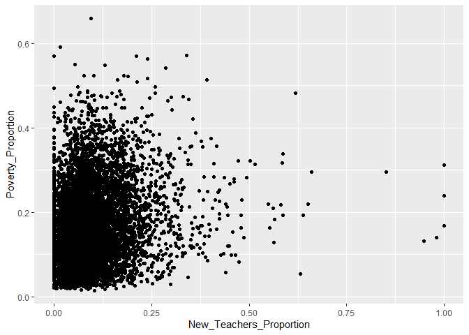<!-- -->
I am going to look at the correlation for new teachers.

``` r
cor.test(project_data$New_Teachers_Proportion, project_data$Poverty_Proportion)
```

    ## 
    ##  Pearson's product-moment correlation
    ## 
    ## data:  project_data$New_Teachers_Proportion and project_data$Poverty_Proportion
    ## t = 15.664, df = 7575, p-value < 2.2e-16
    ## alternative hypothesis: true correlation is not equal to 0
    ## 95 percent confidence interval:
    ##  0.155227 0.198849
    ## sample estimates:
    ##      cor 
    ## 0.177125

I am going to graph out absent teacher ratio to see the relationship.

``` r
project_data %>%
  ggplot(aes(Absent_Teacher_Proportion, Poverty_Proportion)) + 
  geom_point()
```

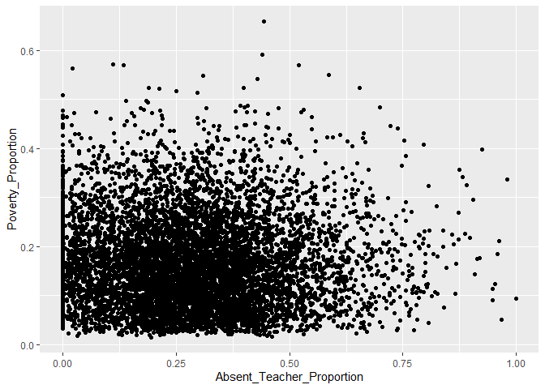<!-- -->
Looking at the correlation between for absent teachers.

``` r
cor.test(project_data$Absent_Teacher_Proportion, project_data$Poverty_Proportion)
```

    ## 
    ##  Pearson's product-moment correlation
    ## 
    ## data:  project_data$Absent_Teacher_Proportion and project_data$Poverty_Proportion
    ## t = -1.1869, df = 7575, p-value = 0.2353
    ## alternative hypothesis: true correlation is not equal to 0
    ## 95 percent confidence interval:
    ##  -0.03614151  0.00888428
    ## sample estimates:
    ##         cor 
    ## -0.01363553

Looking at the graph of counselor ratio.

``` r
project_data %>%
  ggplot(aes(Counselor_Ratio, Poverty_Proportion)) + 
  geom_point()
```

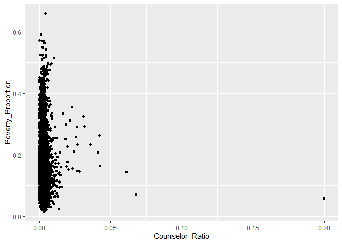<!-- -->
Look at the correlation for counselor ratio.

``` r
cor.test(project_data$Counselor_Ratio, project_data$Poverty_Proportion)
```

    ## 
    ##  Pearson's product-moment correlation
    ## 
    ## data:  project_data$Counselor_Ratio and project_data$Poverty_Proportion
    ## t = -1.1663, df = 7575, p-value = 0.2435
    ## alternative hypothesis: true correlation is not equal to 0
    ## 95 percent confidence interval:
    ##  -0.035905325  0.009120749
    ## sample estimates:
    ##         cor 
    ## -0.01339908

Looking at the graph with the student\_teacher\_ratio.

``` r
project_data %>%
  ggplot(aes(Student_Teacher_Ratio, Poverty_Proportion)) + 
  geom_point()
```

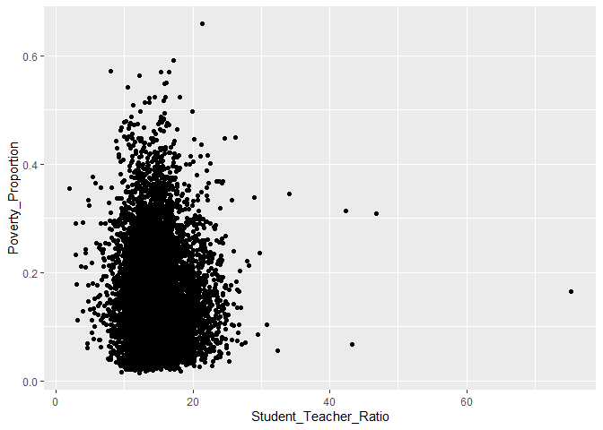<!-- -->
Looking at the correlation with student teacher ratio.

``` r
cor.test(project_data$Student_Teacher_Ratio, project_data$Poverty_Proportion)
```

    ## 
    ##  Pearson's product-moment correlation
    ## 
    ## data:  project_data$Student_Teacher_Ratio and project_data$Poverty_Proportion
    ## t = -0.98489, df = 7575, p-value = 0.3247
    ## alternative hypothesis: true correlation is not equal to 0
    ## 95 percent confidence interval:
    ##  -0.03382379  0.01120460
    ## sample estimates:
    ##         cor 
    ## -0.01131533

Looking at how chronic abseentism graphs with poverty.

``` r
project_data %>%
  ggplot(aes(Absent_Prop, Poverty_Proportion)) + 
  geom_point()
```

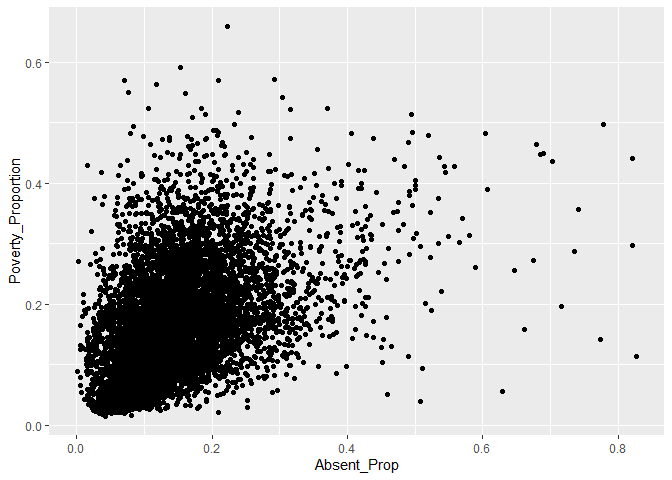<!-- -->
Looking at the correlation for absent and poverty.

``` r
cor.test(project_data$Absent_Prop, project_data$Poverty_Proportion)
```

    ## 
    ##  Pearson's product-moment correlation
    ## 
    ## data:  project_data$Absent_Prop and project_data$Poverty_Proportion
    ## t = 45.646, df = 7575, p-value < 2.2e-16
    ## alternative hypothesis: true correlation is not equal to 0
    ## 95 percent confidence interval:
    ##  0.4466149 0.4819380
    ## sample estimates:
    ##       cor 
    ## 0.4644612

Looking at the graph of students that have taken the SAT or ACT compared
to poverty.

``` r
project_data %>%
  ggplot(aes(Test_Prop, Poverty_Proportion)) + 
  geom_point()
```

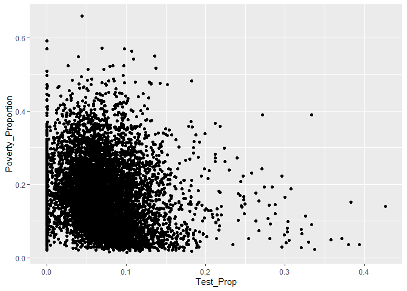<!-- -->
Look at the correlation of test takers.

``` r
cor.test(project_data$Test_Prop, project_data$Poverty_Proportion)
```

    ## 
    ##  Pearson's product-moment correlation
    ## 
    ## data:  project_data$Test_Prop and project_data$Poverty_Proportion
    ## t = -15.704, df = 7575, p-value < 2.2e-16
    ## alternative hypothesis: true correlation is not equal to 0
    ## 95 percent confidence interval:
    ##  -0.1992858 -0.1556708
    ## sample estimates:
    ##        cor 
    ## -0.1775655

Looking at how sports team relates to poverty.

``` r
project_data %>%
  ggplot(aes(Teams_Prop, Poverty_Proportion)) + 
  geom_point()
```

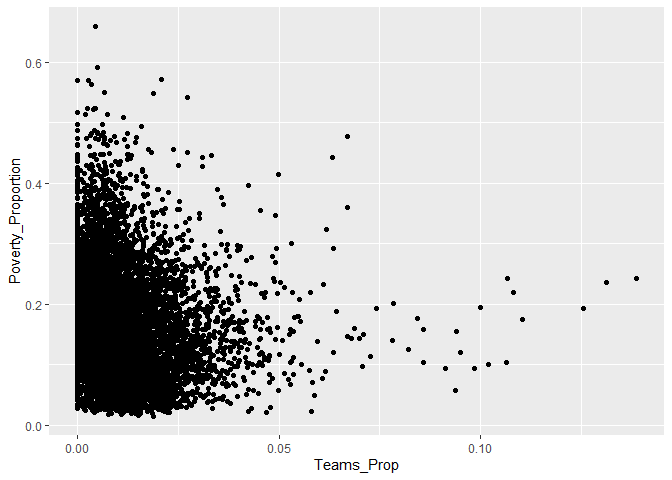<!-- -->
Looking at the correlation of teams to poverty.

``` r
cor.test(project_data$Teams_Prop, project_data$Poverty_Proportion)
```

    ## 
    ##  Pearson's product-moment correlation
    ## 
    ## data:  project_data$Teams_Prop and project_data$Poverty_Proportion
    ## t = -11.637, df = 7575, p-value < 2.2e-16
    ## alternative hypothesis: true correlation is not equal to 0
    ## 95 percent confidence interval:
    ##  -0.1545778 -0.1103341
    ## sample estimates:
    ##        cor 
    ## -0.1325219

Looking at athletes compared to poverty.

``` r
project_data %>%
  ggplot(aes(Athletes_Prop, Poverty_Proportion)) + 
  geom_point()
```

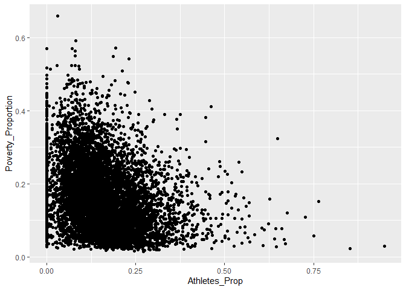<!-- -->
Looking at the correlation of athletes.

``` r
cor.test(project_data$Athletes_Prop, project_data$Poverty_Proportion)
```

    ## 
    ##  Pearson's product-moment correlation
    ## 
    ## data:  project_data$Athletes_Prop and project_data$Poverty_Proportion
    ## t = -25.565, df = 7575, p-value < 2.2e-16
    ## alternative hypothesis: true correlation is not equal to 0
    ## 95 percent confidence interval:
    ##  -0.3024268 -0.2609680
    ## sample estimates:
    ##       cor 
    ## -0.281829

Looking at how ap test takers compare to poverty.

``` r
project_data %>%
  ggplot(aes(Takers_Proportion, Poverty_Proportion)) + 
  geom_point()
```

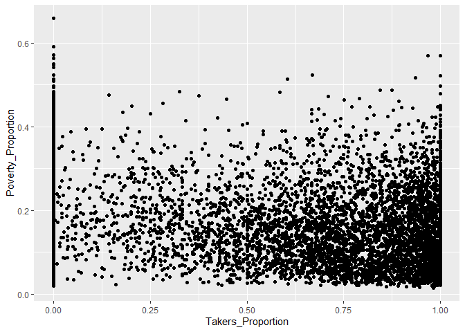<!-- -->
Looking at the correlation for the Ap test takers.

``` r
cor.test(project_data$Takers_Proportion, project_data$Poverty_Proportion)
```

    ## 
    ##  Pearson's product-moment correlation
    ## 
    ## data:  project_data$Takers_Proportion and project_data$Poverty_Proportion
    ## t = -17.961, df = 7575, p-value < 2.2e-16
    ## alternative hypothesis: true correlation is not equal to 0
    ## 95 percent confidence interval:
    ##  -0.2236118 -0.1804164
    ## sample estimates:
    ##        cor 
    ## -0.2021124

Looking at AP students compared to poverty.

``` r
project_data %>%
  ggplot(aes(AP_Prop, Poverty_Proportion)) + 
  geom_point()
```

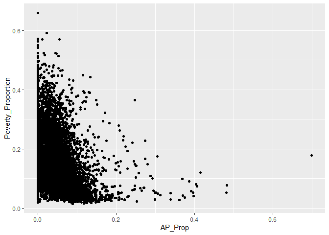<!-- -->
Correlation of AP students to poverty.

``` r
cor.test(project_data$AP_Prop, project_data$Poverty_Proportion)
```

    ## 
    ##  Pearson's product-moment correlation
    ## 
    ## data:  project_data$AP_Prop and project_data$Poverty_Proportion
    ## t = -33.169, df = 7575, p-value < 2.2e-16
    ## alternative hypothesis: true correlation is not equal to 0
    ## 95 percent confidence interval:
    ##  -0.3756202 -0.3362946
    ## sample estimates:
    ##        cor 
    ## -0.3561151

Suspension days compared to poverty.

``` r
project_data %>%
  ggplot(aes(AVG_Suspenion, Poverty_Proportion)) + 
  geom_point()
```

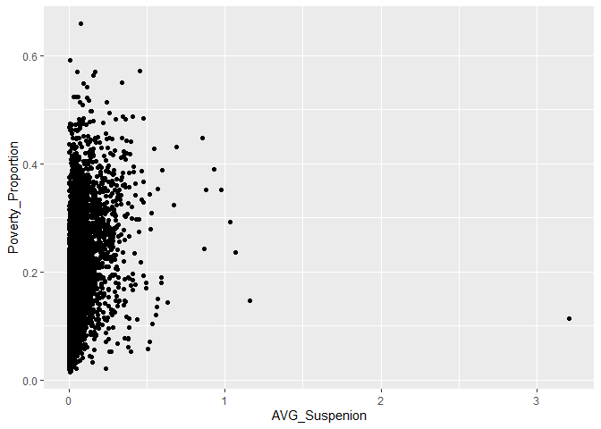<!-- -->
I want to look at the correlation of suspension with poverty.

``` r
cor.test(project_data$AVG_Suspenion, project_data$Poverty_Proportion)
```

    ## 
    ##  Pearson's product-moment correlation
    ## 
    ## data:  project_data$AVG_Suspenion and project_data$Poverty_Proportion
    ## t = 32.058, df = 7575, p-value < 2.2e-16
    ## alternative hypothesis: true correlation is not equal to 0
    ## 95 percent confidence interval:
    ##  0.3256558 0.3653123
    ## sample estimates:
    ##       cor 
    ## 0.3456383

I want to look at expulsions compared to poverty.

``` r
project_data %>%
  ggplot(aes(Expulsion_Prop, Poverty_Proportion)) + 
  geom_point()
```

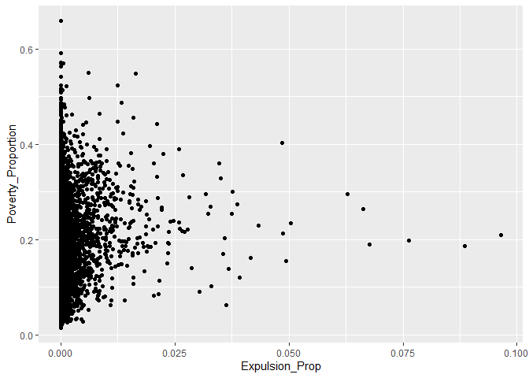<!-- -->
Look at correlation of expulsion to poverty.

``` r
cor.test(project_data$Expulsion_Prop, project_data$Poverty_Proportion)
```

    ## 
    ##  Pearson's product-moment correlation
    ## 
    ## data:  project_data$Expulsion_Prop and project_data$Poverty_Proportion
    ## t = 12.753, df = 7575, p-value < 2.2e-16
    ## alternative hypothesis: true correlation is not equal to 0
    ## 95 percent confidence interval:
    ##  0.1228645 0.1669525
    ## sample estimates:
    ##       cor 
    ## 0.1449805

Police involvement compared to poverty.

``` r
project_data %>%
  ggplot(aes(Police_Prop, Poverty_Proportion)) + 
  geom_point()
```

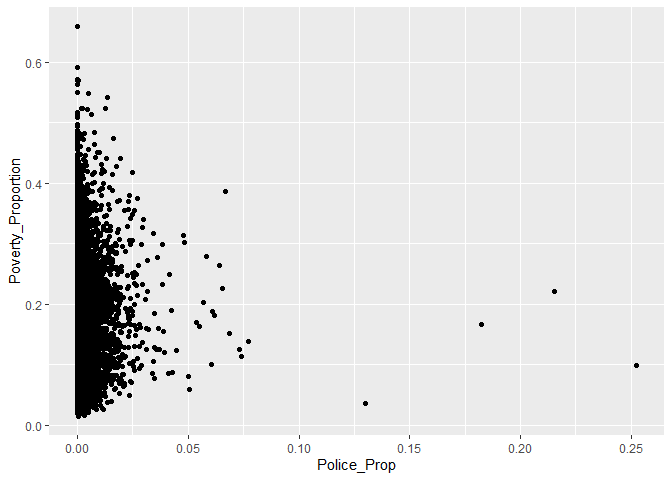<!-- -->
Correlation of police involvement to poverty.

``` r
cor.test(project_data$Police_Prop, project_data$Poverty_Proportion)
```

    ## 
    ##  Pearson's product-moment correlation
    ## 
    ## data:  project_data$Police_Prop and project_data$Poverty_Proportion
    ## t = 3.0378, df = 7575, p-value = 0.002391
    ## alternative hypothesis: true correlation is not equal to 0
    ## 95 percent confidence interval:
    ##  0.01237508 0.05735447
    ## sample estimates:
    ##        cor 
    ## 0.03488244

Student proportion compared to population and poverty.

``` r
project_data %>%
  ggplot(aes(Student_Prop, Poverty_Proportion)) + 
  geom_point()
```

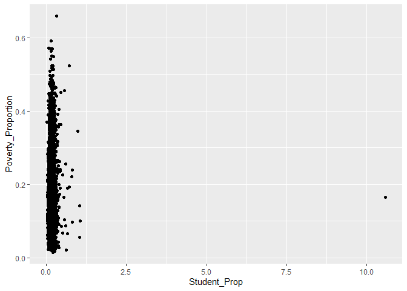<!-- -->
Look at the correlation of the student proportion.

``` r
cor.test(project_data$Student_Prop, project_data$Poverty_Proportion)
```

    ## 
    ##  Pearson's product-moment correlation
    ## 
    ## data:  project_data$Student_Prop and project_data$Poverty_Proportion
    ## t = 0.27069, df = 7575, p-value = 0.7866
    ## alternative hypothesis: true correlation is not equal to 0
    ## 95 percent confidence interval:
    ##  -0.01940834  0.02562538
    ## sample estimates:
    ##         cor 
    ## 0.003110098

For the next part I will look at correlations as they relate to bullying
on race and gender.

``` r
project_data %>%
  ggplot(aes(Race_Disc, Poverty_Proportion)) + 
  geom_point()
```

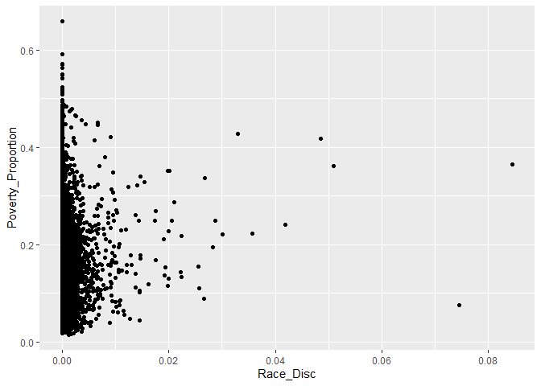<!-- -->

``` r
cor.test(project_data$Race_Disc, project_data$Poverty_Proportion)
```

    ## 
    ##  Pearson's product-moment correlation
    ## 
    ## data:  project_data$Race_Disc and project_data$Poverty_Proportion
    ## t = 0.91445, df = 7575, p-value = 0.3605
    ## alternative hypothesis: true correlation is not equal to 0
    ## 95 percent confidence interval:
    ##  -0.01201379  0.03301540
    ## sample estimates:
    ##        cor 
    ## 0.01050613

``` r
project_data %>%
  ggplot(aes(Race_Reports, Poverty_Proportion)) + 
  geom_point()
```

<!-- -->

``` r
cor.test(project_data$Race_Reports, project_data$Poverty_Proportion)
```

    ## 
    ##  Pearson's product-moment correlation
    ## 
    ## data:  project_data$Race_Reports and project_data$Poverty_Proportion
    ## t = 0.94381, df = 7575, p-value = 0.3453
    ## alternative hypothesis: true correlation is not equal to 0
    ## 95 percent confidence interval:
    ##  -0.01167643  0.03335243
    ## sample estimates:
    ##       cor 
    ## 0.0108435

``` r
project_data %>%
  ggplot(aes(Gender_Disc, Poverty_Proportion)) + 
  geom_point()
```

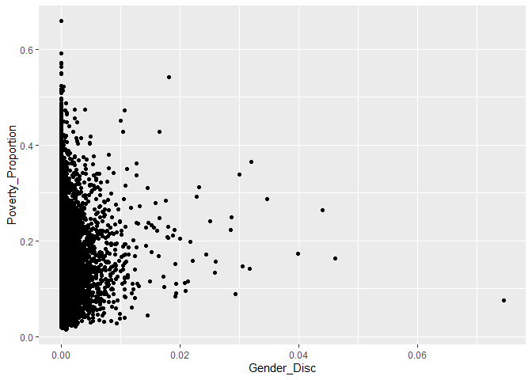<!-- -->

``` r
cor.test(project_data$Gender_Disc, project_data$Poverty_Proportion)
```

    ## 
    ##  Pearson's product-moment correlation
    ## 
    ## data:  project_data$Gender_Disc and project_data$Poverty_Proportion
    ## t = -0.40232, df = 7575, p-value = 0.6875
    ## alternative hypothesis: true correlation is not equal to 0
    ## 95 percent confidence interval:
    ##  -0.02713678  0.01789641
    ## sample estimates:
    ##          cor 
    ## -0.004622526

``` r
project_data %>%
  ggplot(aes(Gender_Reports, Poverty_Proportion)) + 
  geom_point()
```

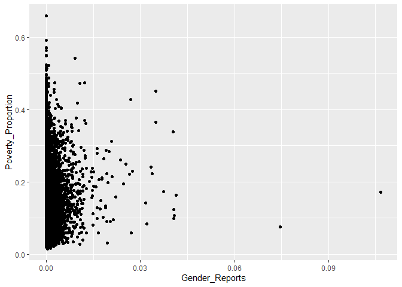<!-- -->

``` r
cor.test(project_data$Gender_Reports, project_data$Poverty_Proportion)
```

    ## 
    ##  Pearson's product-moment correlation
    ## 
    ## data:  project_data$Gender_Reports and project_data$Poverty_Proportion
    ## t = -0.83638, df = 7575, p-value = 0.403
    ## alternative hypothesis: true correlation is not equal to 0
    ## 95 percent confidence interval:
    ##  -0.03211945  0.01291055
    ## sample estimates:
    ##         cor 
    ## -0.00960932

I will now run correlations on the different courses that are offered by
districts.

``` r
project_data %>%
  ggplot(aes(Alg1, Poverty_Proportion)) + 
  geom_point()
```

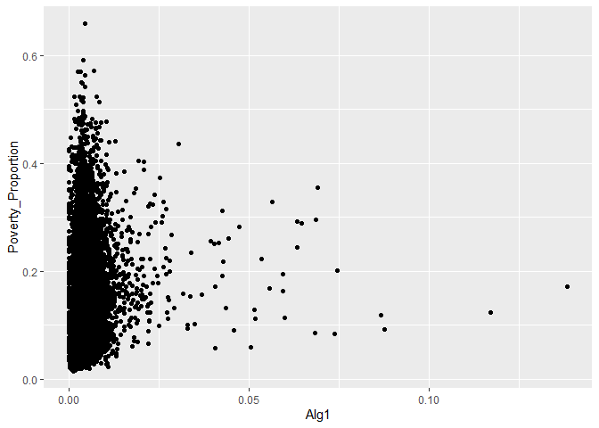<!-- -->

``` r
cor.test(project_data$Alg1, project_data$Poverty_Proportion)
```

    ## 
    ##  Pearson's product-moment correlation
    ## 
    ## data:  project_data$Alg1 and project_data$Poverty_Proportion
    ## t = 6.8983, df = 7575, p-value = 5.687e-12
    ## alternative hypothesis: true correlation is not equal to 0
    ## 95 percent confidence interval:
    ##  0.05659529 0.10134845
    ## sample estimates:
    ##        cor 
    ## 0.07901168

``` r
project_data %>%
  ggplot(aes(Alg2, Poverty_Proportion)) + 
  geom_point()
```

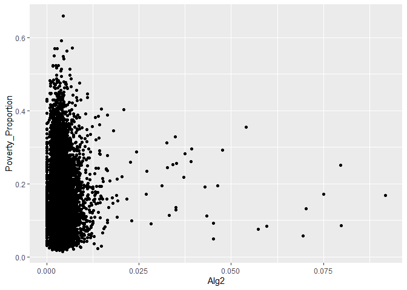<!-- -->

``` r
cor.test(project_data$Alg2, project_data$Poverty_Proportion)
```

    ## 
    ##  Pearson's product-moment correlation
    ## 
    ## data:  project_data$Alg2 and project_data$Poverty_Proportion
    ## t = 0.45014, df = 7575, p-value = 0.6526
    ## alternative hypothesis: true correlation is not equal to 0
    ## 95 percent confidence interval:
    ##  -0.01734719  0.02768576
    ## sample estimates:
    ##         cor 
    ## 0.005171911

``` r
project_data %>%
  ggplot(aes(Geo, Poverty_Proportion)) + 
  geom_point()
```

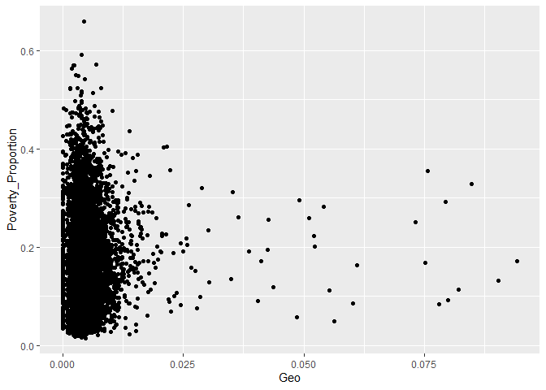<!-- -->

``` r
cor.test(project_data$Geo, project_data$Poverty_Proportion)
```

    ## 
    ##  Pearson's product-moment correlation
    ## 
    ## data:  project_data$Geo and project_data$Poverty_Proportion
    ## t = 3.4018, df = 7575, p-value = 0.0006728
    ## alternative hypothesis: true correlation is not equal to 0
    ## 95 percent confidence interval:
    ##  0.01655374 0.06151924
    ## sample estimates:
    ##        cor 
    ## 0.03905626

``` r
project_data %>%
  ggplot(aes(AdvMath, Poverty_Proportion)) + 
  geom_point()
```

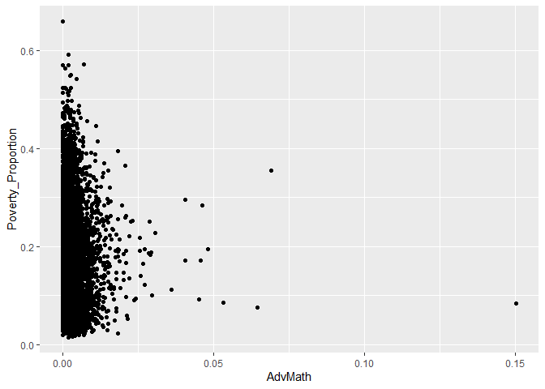<!-- -->

``` r
cor.test(project_data$AdvMath, project_data$Poverty_Proportion)
```

    ## 
    ##  Pearson's product-moment correlation
    ## 
    ## data:  project_data$AdvMath and project_data$Poverty_Proportion
    ## t = -5.9581, df = 7575, p-value = 2.667e-09
    ## alternative hypothesis: true correlation is not equal to 0
    ## 95 percent confidence interval:
    ##  -0.09067414 -0.04584993
    ## sample estimates:
    ##        cor 
    ## -0.0682965

``` r
project_data %>%
  ggplot(aes(Calc, Poverty_Proportion)) + 
  geom_point()
```

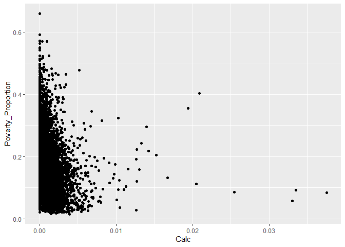<!-- -->

``` r
cor.test(project_data$Calc, project_data$Poverty_Proportion)
```

    ## 
    ##  Pearson's product-moment correlation
    ## 
    ## data:  project_data$Calc and project_data$Poverty_Proportion
    ## t = -18.682, df = 7575, p-value < 2.2e-16
    ## alternative hypothesis: true correlation is not equal to 0
    ## 95 percent confidence interval:
    ##  -0.2312964 -0.1882449
    ## sample estimates:
    ##        cor 
    ## -0.2098724

``` r
project_data %>%
  ggplot(aes(Bio, Poverty_Proportion)) + 
  geom_point()
```

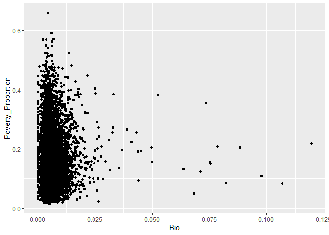<!-- -->

``` r
cor.test(project_data$Bio, project_data$Poverty_Proportion)
```

    ## 
    ##  Pearson's product-moment correlation
    ## 
    ## data:  project_data$Bio and project_data$Poverty_Proportion
    ## t = 1.0848, df = 7575, p-value = 0.2781
    ## alternative hypothesis: true correlation is not equal to 0
    ## 95 percent confidence interval:
    ##  -0.01005704  0.03497013
    ## sample estimates:
    ##        cor 
    ## 0.01246286

``` r
project_data %>%
  ggplot(aes(Chem, Poverty_Proportion)) + 
  geom_point()
```

<!-- -->

``` r
cor.test(project_data$Chem, project_data$Poverty_Proportion)
```

    ## 
    ##  Pearson's product-moment correlation
    ## 
    ## data:  project_data$Chem and project_data$Poverty_Proportion
    ## t = -5.6247, df = 7575, p-value = 1.925e-08
    ## alternative hypothesis: true correlation is not equal to 0
    ## 95 percent confidence interval:
    ##  -0.08688211 -0.04203517
    ## sample estimates:
    ##        cor 
    ## -0.0644912

``` r
project_data %>%
  ggplot(aes(Phys, Poverty_Proportion)) + 
  geom_point()
```

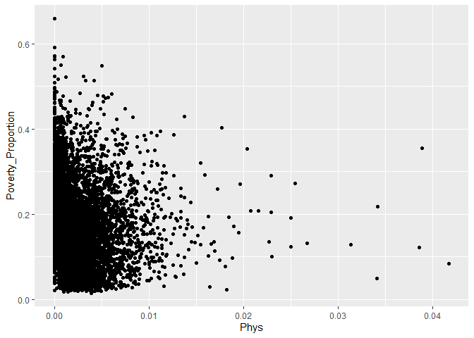<!-- -->

``` r
cor.test(project_data$Phys, project_data$Poverty_Proportion)
```

    ## 
    ##  Pearson's product-moment correlation
    ## 
    ## data:  project_data$Phys and project_data$Poverty_Proportion
    ## t = -9.4355, df = 7575, p-value < 2.2e-16
    ## alternative hypothesis: true correlation is not equal to 0
    ## 95 percent confidence interval:
    ##  -0.12998094 -0.08546966
    ## sample estimates:
    ##        cor 
    ## -0.1077793

I am going to look at the data for students that passed Algebra and the
correlations.

``` r
project_data %>%
  ggplot(aes(Early_Pass, Poverty_Proportion)) + 
  geom_point()
```

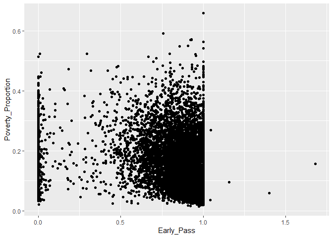<!-- -->

``` r
cor.test(project_data$Early_Pass, project_data$Poverty_Proportion)
```

    ## 
    ##  Pearson's product-moment correlation
    ## 
    ## data:  project_data$Early_Pass and project_data$Poverty_Proportion
    ## t = -12.505, df = 7575, p-value < 2.2e-16
    ## alternative hypothesis: true correlation is not equal to 0
    ## 95 percent confidence interval:
    ##  -0.1642104 -0.1200866
    ## sample estimates:
    ##        cor 
    ## -0.1422192

``` r
project_data %>%
  ggplot(aes(Late_Pass, Poverty_Proportion)) + 
  geom_point()
```

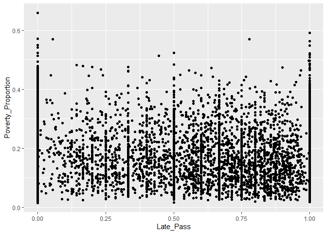<!-- -->

``` r
cor.test(project_data$Late_Pass, project_data$Poverty_Proportion)
```

    ## 
    ##  Pearson's product-moment correlation
    ## 
    ## data:  project_data$Late_Pass and project_data$Poverty_Proportion
    ## t = -3.6367, df = 7575, p-value = 0.000278
    ## alternative hypothesis: true correlation is not equal to 0
    ## 95 percent confidence interval:
    ##  -0.06420461 -0.01924890
    ## sample estimates:
    ##         cor 
    ## -0.04174788

Look at demographics and how they relate to poverty.

``` r
project_data %>%
  ggplot(aes(Non_White_Students, Poverty_Proportion)) + 
  geom_point()
```

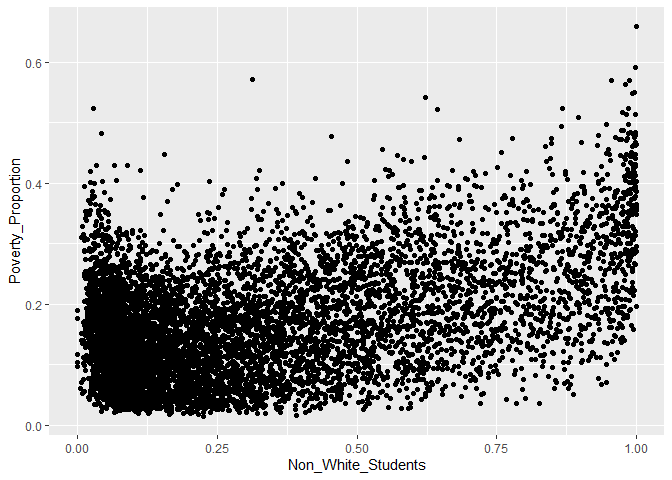<!-- -->

``` r
cor.test(project_data$Non_White_Students, project_data$Poverty_Proportion)
```

    ## 
    ##  Pearson's product-moment correlation
    ## 
    ## data:  project_data$Non_White_Students and project_data$Poverty_Proportion
    ## t = 44.56, df = 7575, p-value < 2.2e-16
    ## alternative hypothesis: true correlation is not equal to 0
    ## 95 percent confidence interval:
    ##  0.4377004 0.4733854
    ## sample estimates:
    ##      cor 
    ## 0.455726

Look at how grad rate and poverty relate and the correlation of it.

``` r
project_data %>%
  ggplot(aes(Grad_Rate, Poverty_Proportion)) + 
  geom_point()
```

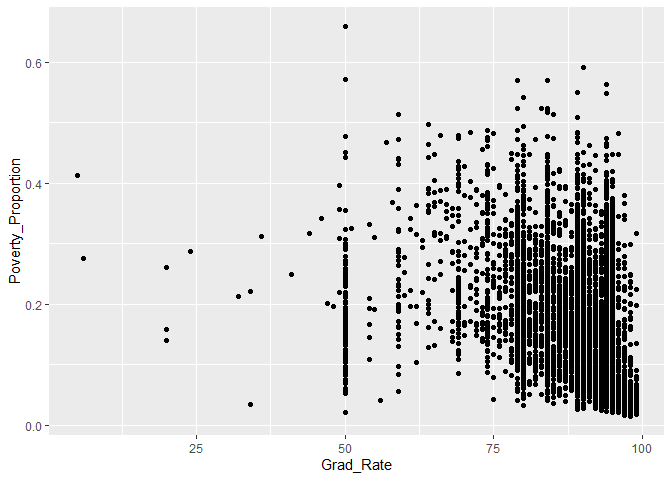<!-- -->

``` r
cor.test(project_data$Grad_Rate, project_data$Poverty_Proportion)
```

    ## 
    ##  Pearson's product-moment correlation
    ## 
    ## data:  project_data$Grad_Rate and project_data$Poverty_Proportion
    ## t = -29.365, df = 7575, p-value < 2.2e-16
    ## alternative hypothesis: true correlation is not equal to 0
    ## 95 percent confidence interval:
    ##  -0.3397563 -0.2993224
    ## sample estimates:
    ##        cor 
    ## -0.3196849
