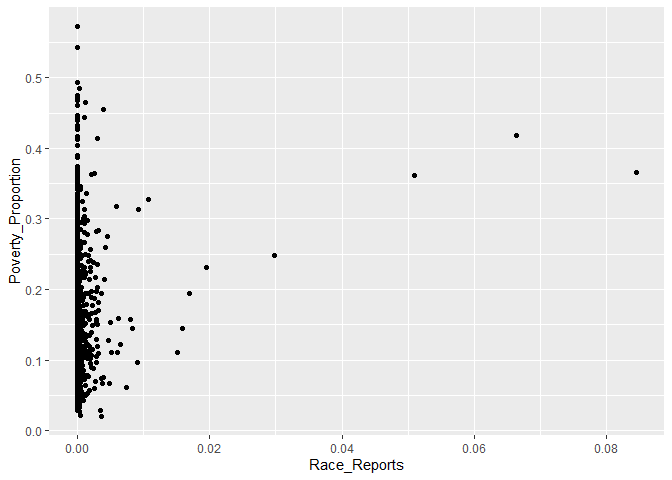
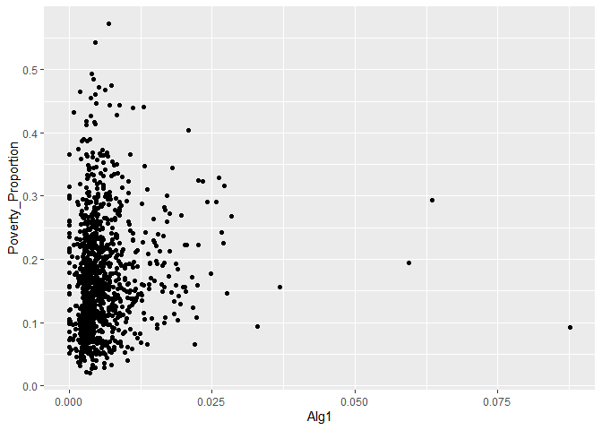

West Correlations
================
Derek Castleman
9/1/2021

In this markdown I will look at each of the features and run
correlations on them to see how they relate with poverty proportion. I
will also graph out each one of them to get a visual on the
relationship.

I am going to first load in the project data that was prepared and then
take a look at it.

``` r
library(tidyverse)
```

    ## -- Attaching packages --------------------------------------- tidyverse 1.3.0 --

    ## v ggplot2 3.3.3     v purrr   0.3.4
    ## v tibble  3.0.6     v dplyr   1.0.4
    ## v tidyr   1.1.2     v stringr 1.4.0
    ## v readr   1.4.0     v forcats 0.5.1

    ## -- Conflicts ------------------------------------------ tidyverse_conflicts() --
    ## x dplyr::filter() masks stats::filter()
    ## x dplyr::lag()    masks stats::lag()

``` r
project_data <- read_csv("west_data.csv")
```

    ## Warning: Missing column names filled in: 'X1' [1]

    ## 
    ## -- Column specification --------------------------------------------------------
    ## cols(
    ##   .default = col_double(),
    ##   `Lea State.x` = col_character(),
    ##   LEA.x = col_character()
    ## )
    ## i Use `spec()` for the full column specifications.

``` r
project_data
```

    ## # A tibble: 1,094 x 39
    ##       X1 `Unnamed: 0`     ID `Lea State.x` LEA.x Area_Population
    ##    <dbl>        <dbl>  <dbl> <chr>         <chr>           <dbl>
    ##  1   124          125 200050 AK            Alas~            2295
    ##  2   125          126 200007 AK            Aleu~            3370
    ##  3   126          127 200180 AK            Anch~          294356
    ##  4   127          128 200525 AK            Anne~            1525
    ##  5   128          129 200020 AK            Beri~            6164
    ##  6   129          130 200030 AK            Bris~             867
    ##  7   130          131 200730 AK            Chat~            1291
    ##  8   131          132 200800 AK            Chug~             451
    ##  9   132          133 200070 AK            Copp~            2721
    ## 10   133          134 200090 AK            Crai~            1254
    ## # ... with 1,084 more rows, and 33 more variables: Children_Poverty <dbl>,
    ## #   Poverty_Proportion <dbl>, Student_Prop <dbl>, District_Population <dbl>,
    ## #   Non_White_Students <dbl>, New_Teachers_Proportion <dbl>,
    ## #   Absent_Teacher_Proportion <dbl>, Counselor_Ratio <dbl>,
    ## #   Student_Teacher_Ratio <dbl>, Absent_Prop <dbl>, Test_Prop <dbl>,
    ## #   Teams_Prop <dbl>, Athletes_Prop <dbl>, Takers_Proportion <dbl>,
    ## #   AP_Prop <dbl>, AVG_Suspenion <dbl>, Expulsion_Prop <dbl>,
    ## #   Police_Prop <dbl>, Race_Disc <dbl>, Race_Reports <dbl>, Gender_Disc <dbl>,
    ## #   Gender_Reports <dbl>, Alg1 <dbl>, Alg2 <dbl>, Geo <dbl>, AdvMath <dbl>,
    ## #   Calc <dbl>, Bio <dbl>, Chem <dbl>, Phys <dbl>, Early_Pass <dbl>,
    ## #   Late_Pass <dbl>, Grad_Rate <dbl>

Look at a plot of poverty compared to new teacher.

``` r
project_data %>%
  ggplot(aes(New_Teachers_Proportion, Poverty_Proportion)) + 
  geom_point()
```

<!-- --> I
am going to look at the correlation for new teachers.

``` r
cor.test(project_data$New_Teachers_Proportion, project_data$Poverty_Proportion)
```

    ## 
    ##  Pearson's product-moment correlation
    ## 
    ## data:  project_data$New_Teachers_Proportion and project_data$Poverty_Proportion
    ## t = 5.4656, df = 1092, p-value = 5.716e-08
    ## alternative hypothesis: true correlation is not equal to 0
    ## 95 percent confidence interval:
    ##  0.1049242 0.2203163
    ## sample estimates:
    ##       cor 
    ## 0.1631783

I am going to graph out absent teacher ratio to see the relationship.

``` r
project_data %>%
  ggplot(aes(Absent_Teacher_Proportion, Poverty_Proportion)) + 
  geom_point()
```

<!-- -->
Looking at the correlation between for absent teachers.

``` r
cor.test(project_data$Absent_Teacher_Proportion, project_data$Poverty_Proportion)
```

    ## 
    ##  Pearson's product-moment correlation
    ## 
    ## data:  project_data$Absent_Teacher_Proportion and project_data$Poverty_Proportion
    ## t = -2.6643, df = 1092, p-value = 0.007829
    ## alternative hypothesis: true correlation is not equal to 0
    ## 95 percent confidence interval:
    ##  -0.13897047 -0.02119567
    ## sample estimates:
    ##         cor 
    ## -0.08036355

Looking at the graph of counselor ratio.

``` r
project_data %>%
  ggplot(aes(Counselor_Ratio, Poverty_Proportion)) + 
  geom_point()
```

<!-- -->
Look at the correlation for counselor ratio.

``` r
cor.test(project_data$Counselor_Ratio, project_data$Poverty_Proportion)
```

    ## 
    ##  Pearson's product-moment correlation
    ## 
    ## data:  project_data$Counselor_Ratio and project_data$Poverty_Proportion
    ## t = 0.066778, df = 1092, p-value = 0.9468
    ## alternative hypothesis: true correlation is not equal to 0
    ## 95 percent confidence interval:
    ##  -0.05725491  0.06128229
    ## sample estimates:
    ##         cor 
    ## 0.002020788

Looking at the graph with the student\_teacher\_ratio.

``` r
project_data %>%
  ggplot(aes(Student_Teacher_Ratio, Poverty_Proportion)) + 
  geom_point()
```

<!-- -->
Looking at the correlation with student teacher ratio.

``` r
cor.test(project_data$Student_Teacher_Ratio, project_data$Poverty_Proportion)
```

    ## 
    ##  Pearson's product-moment correlation
    ## 
    ## data:  project_data$Student_Teacher_Ratio and project_data$Poverty_Proportion
    ## t = -5.6469, df = 1092, p-value = 2.083e-08
    ## alternative hypothesis: true correlation is not equal to 0
    ## 95 percent confidence interval:
    ##  -0.2254584 -0.1102724
    ## sample estimates:
    ##        cor 
    ## -0.1684404

Looking at how chronic abseentism graphs with poverty.

``` r
project_data %>%
  ggplot(aes(Absent_Prop, Poverty_Proportion)) + 
  geom_point()
```

<!-- -->
Looking at the correlation for absent and poverty.

``` r
cor.test(project_data$Absent_Prop, project_data$Poverty_Proportion)
```

    ## 
    ##  Pearson's product-moment correlation
    ## 
    ## data:  project_data$Absent_Prop and project_data$Poverty_Proportion
    ## t = 12.094, df = 1092, p-value < 2.2e-16
    ## alternative hypothesis: true correlation is not equal to 0
    ## 95 percent confidence interval:
    ##  0.2903421 0.3949207
    ## sample estimates:
    ##       cor 
    ## 0.3436966

Looking at the graph of students that have taken the SAT or ACT compared
to poverty.

``` r
project_data %>%
  ggplot(aes(Test_Prop, Poverty_Proportion)) + 
  geom_point()
```

<!-- -->
Look at the correlation of test takers.

``` r
cor.test(project_data$Test_Prop, project_data$Poverty_Proportion)
```

    ## 
    ##  Pearson's product-moment correlation
    ## 
    ## data:  project_data$Test_Prop and project_data$Poverty_Proportion
    ## t = -4.0406, df = 1092, p-value = 5.705e-05
    ## alternative hypothesis: true correlation is not equal to 0
    ## 95 percent confidence interval:
    ##  -0.17934865 -0.06255107
    ## sample estimates:
    ##      cor 
    ## -0.12137

Looking at how sports team relates to poverty.

``` r
project_data %>%
  ggplot(aes(Teams_Prop, Poverty_Proportion)) + 
  geom_point()
```

<!-- -->
Looking at the correlation of teams to poverty.

``` r
cor.test(project_data$Teams_Prop, project_data$Poverty_Proportion)
```

    ## 
    ##  Pearson's product-moment correlation
    ## 
    ## data:  project_data$Teams_Prop and project_data$Poverty_Proportion
    ## t = 1.616, df = 1092, p-value = 0.1064
    ## alternative hypothesis: true correlation is not equal to 0
    ## 95 percent confidence interval:
    ##  -0.01045596  0.10779992
    ## sample estimates:
    ##        cor 
    ## 0.04884315

Looking at athletes compared to poverty.

``` r
project_data %>%
  ggplot(aes(Athletes_Prop, Poverty_Proportion)) + 
  geom_point()
```

<!-- -->
Looking at the correlation of athletes.

``` r
cor.test(project_data$Athletes_Prop, project_data$Poverty_Proportion)
```

    ## 
    ##  Pearson's product-moment correlation
    ## 
    ## data:  project_data$Athletes_Prop and project_data$Poverty_Proportion
    ## t = -2.7927, df = 1092, p-value = 0.005318
    ## alternative hypothesis: true correlation is not equal to 0
    ## 95 percent confidence interval:
    ##  -0.14276715 -0.02506715
    ## sample estimates:
    ##         cor 
    ## -0.08421087

Looking at how ap test takers compare to poverty.

``` r
project_data %>%
  ggplot(aes(Takers_Proportion, Poverty_Proportion)) + 
  geom_point()
```

<!-- -->
Looking at the correlation for the Ap test takers.

``` r
cor.test(project_data$Takers_Proportion, project_data$Poverty_Proportion)
```

    ## 
    ##  Pearson's product-moment correlation
    ## 
    ## data:  project_data$Takers_Proportion and project_data$Poverty_Proportion
    ## t = -6.7078, df = 1092, p-value = 3.164e-11
    ## alternative hypothesis: true correlation is not equal to 0
    ## 95 percent confidence interval:
    ##  -0.2551912 -0.1413287
    ## sample estimates:
    ##        cor 
    ## -0.1989312

Looking at AP students compared to poverty.

``` r
project_data %>%
  ggplot(aes(AP_Prop, Poverty_Proportion)) + 
  geom_point()
```

<!-- -->
Correlation of AP students to poverty.

``` r
cor.test(project_data$AP_Prop, project_data$Poverty_Proportion)
```

    ## 
    ##  Pearson's product-moment correlation
    ## 
    ## data:  project_data$AP_Prop and project_data$Poverty_Proportion
    ## t = -10.11, df = 1092, p-value < 2.2e-16
    ## alternative hypothesis: true correlation is not equal to 0
    ## 95 percent confidence interval:
    ##  -0.3458169 -0.2373913
    ## sample estimates:
    ##        cor 
    ## -0.2925441

Suspension days compared to poverty.

``` r
project_data %>%
  ggplot(aes(AVG_Suspenion, Poverty_Proportion)) + 
  geom_point()
```

<!-- --> I
want to look at the correlation of suspension with poverty.

``` r
cor.test(project_data$AVG_Suspenion, project_data$Poverty_Proportion)
```

    ## 
    ##  Pearson's product-moment correlation
    ## 
    ## data:  project_data$AVG_Suspenion and project_data$Poverty_Proportion
    ## t = 7.4634, df = 1092, p-value = 1.718e-13
    ## alternative hypothesis: true correlation is not equal to 0
    ## 95 percent confidence interval:
    ##  0.1631663 0.2759700
    ## sample estimates:
    ##       cor 
    ## 0.2203046

I want to look at expulsions compared to poverty.

``` r
project_data %>%
  ggplot(aes(Expulsion_Prop, Poverty_Proportion)) + 
  geom_point()
```

<!-- -->
Look at correlation of expulsion to poverty.

``` r
cor.test(project_data$Expulsion_Prop, project_data$Poverty_Proportion)
```

    ## 
    ##  Pearson's product-moment correlation
    ## 
    ## data:  project_data$Expulsion_Prop and project_data$Poverty_Proportion
    ## t = 1.4814, df = 1092, p-value = 0.1388
    ## alternative hypothesis: true correlation is not equal to 0
    ## 95 percent confidence interval:
    ##  -0.01452312  0.10377764
    ## sample estimates:
    ##        cor 
    ## 0.04478426

Police involvement compared to poverty.

``` r
project_data %>%
  ggplot(aes(Police_Prop, Poverty_Proportion)) + 
  geom_point()
```

<!-- -->
Correlation of police involvement to poverty.

``` r
cor.test(project_data$Police_Prop, project_data$Poverty_Proportion)
```

    ## 
    ##  Pearson's product-moment correlation
    ## 
    ## data:  project_data$Police_Prop and project_data$Poverty_Proportion
    ## t = 1.5056, df = 1092, p-value = 0.1324
    ## alternative hypothesis: true correlation is not equal to 0
    ## 95 percent confidence interval:
    ##  -0.01379025  0.10450272
    ## sample estimates:
    ##        cor 
    ## 0.04551579

Student proportion compared to population and poverty.

``` r
project_data %>%
  ggplot(aes(Student_Prop, Poverty_Proportion)) + 
  geom_point()
```

<!-- -->
Look at the correlation of the student proportion.

``` r
cor.test(project_data$Student_Prop, project_data$Poverty_Proportion)
```

    ## 
    ##  Pearson's product-moment correlation
    ## 
    ## data:  project_data$Student_Prop and project_data$Poverty_Proportion
    ## t = 0.67089, df = 1092, p-value = 0.5024
    ## alternative hypothesis: true correlation is not equal to 0
    ## 95 percent confidence interval:
    ##  -0.03901795  0.07947106
    ## sample estimates:
    ##        cor 
    ## 0.02029783

For the next part I will look at correlations as they relate to bullying
on race and gender.

``` r
project_data %>%
  ggplot(aes(Race_Disc, Poverty_Proportion)) + 
  geom_point()
```

<!-- -->

``` r
cor.test(project_data$Race_Disc, project_data$Poverty_Proportion)
```

    ## 
    ##  Pearson's product-moment correlation
    ## 
    ## data:  project_data$Race_Disc and project_data$Poverty_Proportion
    ## t = 3.4661, df = 1092, p-value = 0.0005486
    ## alternative hypothesis: true correlation is not equal to 0
    ## 95 percent confidence interval:
    ##  0.04532813 0.16258036
    ## sample estimates:
    ##       cor 
    ## 0.1043167

``` r
project_data %>%
  ggplot(aes(Race_Reports, Poverty_Proportion)) + 
  geom_point()
```

<!-- -->

``` r
cor.test(project_data$Race_Reports, project_data$Poverty_Proportion)
```

    ## 
    ##  Pearson's product-moment correlation
    ## 
    ## data:  project_data$Race_Reports and project_data$Poverty_Proportion
    ## t = 3.7577, df = 1092, p-value = 0.0001806
    ## alternative hypothesis: true correlation is not equal to 0
    ## 95 percent confidence interval:
    ##  0.05407794 0.17110767
    ## sample estimates:
    ##       cor 
    ## 0.1129846

``` r
project_data %>%
  ggplot(aes(Gender_Disc, Poverty_Proportion)) + 
  geom_point()
```

<!-- -->

``` r
cor.test(project_data$Gender_Disc, project_data$Poverty_Proportion)
```

    ## 
    ##  Pearson's product-moment correlation
    ## 
    ## data:  project_data$Gender_Disc and project_data$Poverty_Proportion
    ## t = 3.4247, df = 1092, p-value = 0.0006383
    ## alternative hypothesis: true correlation is not equal to 0
    ## 95 percent confidence interval:
    ##  0.04408567 0.16136807
    ## sample estimates:
    ##       cor 
    ## 0.1030852

``` r
project_data %>%
  ggplot(aes(Gender_Reports, Poverty_Proportion)) + 
  geom_point()
```

<!-- -->

``` r
cor.test(project_data$Gender_Reports, project_data$Poverty_Proportion)
```

    ## 
    ##  Pearson's product-moment correlation
    ## 
    ## data:  project_data$Gender_Reports and project_data$Poverty_Proportion
    ## t = 3.787, df = 1092, p-value = 0.0001608
    ## alternative hypothesis: true correlation is not equal to 0
    ## 95 percent confidence interval:
    ##  0.05495556 0.17196201
    ## sample estimates:
    ##       cor 
    ## 0.1138536

I will now run correlations on the different courses that are offered by
districts.

``` r
project_data %>%
  ggplot(aes(Alg1, Poverty_Proportion)) + 
  geom_point()
```

<!-- -->

``` r
cor.test(project_data$Alg1, project_data$Poverty_Proportion)
```

    ## 
    ##  Pearson's product-moment correlation
    ## 
    ## data:  project_data$Alg1 and project_data$Poverty_Proportion
    ## t = 3.3078, df = 1092, p-value = 0.0009708
    ## alternative hypothesis: true correlation is not equal to 0
    ## 95 percent confidence interval:
    ##  0.04057276 0.15793856
    ## sample estimates:
    ##        cor 
    ## 0.09960208

``` r
project_data %>%
  ggplot(aes(Alg2, Poverty_Proportion)) + 
  geom_point()
```

<!-- -->

``` r
cor.test(project_data$Alg2, project_data$Poverty_Proportion)
```

    ## 
    ##  Pearson's product-moment correlation
    ## 
    ## data:  project_data$Alg2 and project_data$Poverty_Proportion
    ## t = 2.7297, df = 1092, p-value = 0.00644
    ## alternative hypothesis: true correlation is not equal to 0
    ## 95 percent confidence interval:
    ##  0.02316934 0.14090644
    ## sample estimates:
    ##        cor 
    ## 0.08232513

``` r
project_data %>%
  ggplot(aes(Geo, Poverty_Proportion)) + 
  geom_point()
```

<!-- -->

``` r
cor.test(project_data$Geo, project_data$Poverty_Proportion)
```

    ## 
    ##  Pearson's product-moment correlation
    ## 
    ## data:  project_data$Geo and project_data$Poverty_Proportion
    ## t = 2.0207, df = 1092, p-value = 0.04355
    ## alternative hypothesis: true correlation is not equal to 0
    ## 95 percent confidence interval:
    ##  0.00177297 0.11987060
    ## sample estimates:
    ##        cor 
    ## 0.06103539

``` r
project_data %>%
  ggplot(aes(AdvMath, Poverty_Proportion)) + 
  geom_point()
```

<!-- -->

``` r
cor.test(project_data$AdvMath, project_data$Poverty_Proportion)
```

    ## 
    ##  Pearson's product-moment correlation
    ## 
    ## data:  project_data$AdvMath and project_data$Poverty_Proportion
    ## t = -2.7372, df = 1092, p-value = 0.006297
    ## alternative hypothesis: true correlation is not equal to 0
    ## 95 percent confidence interval:
    ##  -0.14112682 -0.02339407
    ## sample estimates:
    ##         cor 
    ## -0.08254845

``` r
project_data %>%
  ggplot(aes(Calc, Poverty_Proportion)) + 
  geom_point()
```

<!-- -->

``` r
cor.test(project_data$Calc, project_data$Poverty_Proportion)
```

    ## 
    ##  Pearson's product-moment correlation
    ## 
    ## data:  project_data$Calc and project_data$Poverty_Proportion
    ## t = -2.8491, df = 1092, p-value = 0.004466
    ## alternative hypothesis: true correlation is not equal to 0
    ## 95 percent confidence interval:
    ##  -0.14443370 -0.02676764
    ## sample estimates:
    ##        cor 
    ## -0.0859002

``` r
project_data %>%
  ggplot(aes(Bio, Poverty_Proportion)) + 
  geom_point()
```

<!-- -->

``` r
cor.test(project_data$Bio, project_data$Poverty_Proportion)
```

    ## 
    ##  Pearson's product-moment correlation
    ## 
    ## data:  project_data$Bio and project_data$Poverty_Proportion
    ## t = 0.67841, df = 1092, p-value = 0.4977
    ## alternative hypothesis: true correlation is not equal to 0
    ## 95 percent confidence interval:
    ##  -0.03879069  0.07969723
    ## sample estimates:
    ##        cor 
    ## 0.02052534

``` r
project_data %>%
  ggplot(aes(Chem, Poverty_Proportion)) + 
  geom_point()
```

<!-- -->

``` r
cor.test(project_data$Chem, project_data$Poverty_Proportion)
```

    ## 
    ##  Pearson's product-moment correlation
    ## 
    ## data:  project_data$Chem and project_data$Poverty_Proportion
    ## t = -1.6794, df = 1092, p-value = 0.09335
    ## alternative hypothesis: true correlation is not equal to 0
    ## 95 percent confidence interval:
    ##  -0.109695458  0.008537906
    ## sample estimates:
    ##         cor 
    ## -0.05075662

``` r
project_data %>%
  ggplot(aes(Phys, Poverty_Proportion)) + 
  geom_point()
```

<!-- -->

``` r
cor.test(project_data$Phys, project_data$Poverty_Proportion)
```

    ## 
    ##  Pearson's product-moment correlation
    ## 
    ## data:  project_data$Phys and project_data$Poverty_Proportion
    ## t = -1.3336, df = 1092, p-value = 0.1826
    ## alternative hypothesis: true correlation is not equal to 0
    ## 95 percent confidence interval:
    ##  -0.09935659  0.01898901
    ## sample estimates:
    ##         cor 
    ## -0.04032521

I am going to look at the data for students that passed Algebra and the
correlations.

``` r
project_data %>%
  ggplot(aes(Early_Pass, Poverty_Proportion)) + 
  geom_point()
```

<!-- -->

``` r
cor.test(project_data$Early_Pass, project_data$Poverty_Proportion)
```

    ## 
    ##  Pearson's product-moment correlation
    ## 
    ## data:  project_data$Early_Pass and project_data$Poverty_Proportion
    ## t = -3.965, df = 1092, p-value = 7.818e-05
    ## alternative hypothesis: true correlation is not equal to 0
    ## 95 percent confidence interval:
    ##  -0.17714959 -0.06028841
    ## sample estimates:
    ##        cor 
    ## -0.1191316

``` r
project_data %>%
  ggplot(aes(Late_Pass, Poverty_Proportion)) + 
  geom_point()
```

<!-- -->

``` r
cor.test(project_data$Late_Pass, project_data$Poverty_Proportion)
```

    ## 
    ##  Pearson's product-moment correlation
    ## 
    ## data:  project_data$Late_Pass and project_data$Poverty_Proportion
    ## t = -2.3956, df = 1092, p-value = 0.01676
    ## alternative hypothesis: true correlation is not equal to 0
    ## 95 percent confidence interval:
    ##  -0.13101187 -0.01309173
    ## sample estimates:
    ##         cor 
    ## -0.07230447

Look at demographics and how they relate to poverty.

``` r
project_data %>%
  ggplot(aes(Non_White_Students, Poverty_Proportion)) + 
  geom_point()
```

<!-- -->

``` r
cor.test(project_data$Non_White_Students, project_data$Poverty_Proportion)
```

    ## 
    ##  Pearson's product-moment correlation
    ## 
    ## data:  project_data$Non_White_Students and project_data$Poverty_Proportion
    ## t = 14.535, df = 1092, p-value < 2.2e-16
    ## alternative hypothesis: true correlation is not equal to 0
    ## 95 percent confidence interval:
    ##  0.3517362 0.4511159
    ## sample estimates:
    ##       cor 
    ## 0.4026118

Look at how grad rate and poverty relate and the correlation of it.

``` r
project_data %>%
  ggplot(aes(Grad_Rate, Poverty_Proportion)) + 
  geom_point()
```

<!-- -->

``` r
cor.test(project_data$Grad_Rate, project_data$Poverty_Proportion)
```

    ## 
    ##  Pearson's product-moment correlation
    ## 
    ## data:  project_data$Grad_Rate and project_data$Poverty_Proportion
    ## t = -9.9814, df = 1092, p-value < 2.2e-16
    ## alternative hypothesis: true correlation is not equal to 0
    ## 95 percent confidence interval:
    ##  -0.3425471 -0.2338881
    ## sample estimates:
    ##        cor 
    ## -0.2891487
